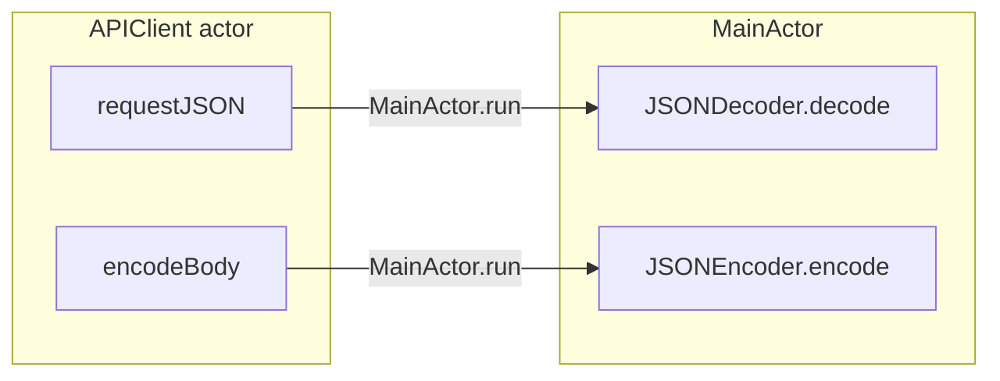

# APIClient Swift 6 — MainActor.run JSON Fix

## Problem

The iOS target sets `SWIFT_DEFAULT_ACTOR_ISOLATION = MainActor` in [`apps/ios/Flashycardy/Flashycardy.xcodeproj/project.pbxproj`](apps/ios/Flashycardy/Flashycardy.xcodeproj/project.pbxproj). That makes synthesized `Codable` conformances MainActor-isolated by default.

[`APIClient`](apps/ios/Flashycardy/Flashycardy/Services/APIClient.swift) is a separate `actor`, so calls like `decoder.decode(Envelope.self, from: data)` (line 99) and `encoder.encode(...)` (line 82) violate Swift 6 isolation rules.



## Approach

Add two small private helpers inside `APIClient` and route all JSON work through them. Use a **fresh** `JSONDecoder` / `JSONEncoder` inside `MainActor.run` (avoids capturing actor-isolated stored properties and sidesteps `Sendable` concerns on Foundation coders).

No changes to model types, envelopes, or project build settings.

## Changes (single file)

**File:** [`apps/ios/Flashycardy/Flashycardy/Services/APIClient.swift`](apps/ios/Flashycardy/Flashycardy/Services/APIClient.swift)

### 1. Add MainActor-isolated JSON helpers

Inside the `actor APIClient` block, add:

```swift
private func decodeJSON<T: Decodable>(_ type: T.Type, from data: Data) async throws -> T {
    try await MainActor.run {
        try JSONDecoder().decode(type, from: data)
    }
}

private func encodeJSON(_ value: some Encodable) async throws -> Data {
    try await MainActor.run {
        try JSONEncoder().encode(value)
    }
}
```

### 2. Update `requestJSON`

- Replace `encoder.encode(AnyEncodable(body))` with `try await encodeJSON(AnyEncodable(body))`.
- Replace `decoder.decode(Envelope.self, from: data)` with `try await decodeJSON(Envelope.self, from: data)`.

### 3. Update `decodeApiError`

Currently synchronous (`throws`). Change signature to `async throws` and replace both `decoder.decode(ErrorEnvelope.self, ...)` calls with `try? await decodeJSON(ErrorEnvelope.self, from: data)`.

Update the single call site in `requestJSON`:

```swift
if let apiError = try await decodeApiError(data: data, statusCode: statusCode) {
```

### 4. Remove unused stored coders (optional cleanup)

After the change, `private let encoder` and `private let decoder` are unused. Remove them and their initialization in `init` to avoid dead state and future confusion.

## Verification

1. **Build** with Xcode (Swift 6 language mode) — confirm the isolation diagnostic at line 34/99 is gone.
2. **Run unit tests:** `FlashycardyTests` (`APIClientTests`, `StudyAnalyticsTests`) — existing decode tests are unaffected (they decode directly in test target, not via `APIClient`).
3. **Smoke test** in simulator: sign in, load dashboard, open deck detail (exercises paginated + data decode paths).

## Follow-up (out of scope)

If you later want decoding off the main thread, migrate to explicit `nonisolated init(from:)` on models/envelopes and drop `SWIFT_DEFAULT_ACTOR_ISOLATION = MainActor` for the networking layer. The current fix is intentionally minimal.
