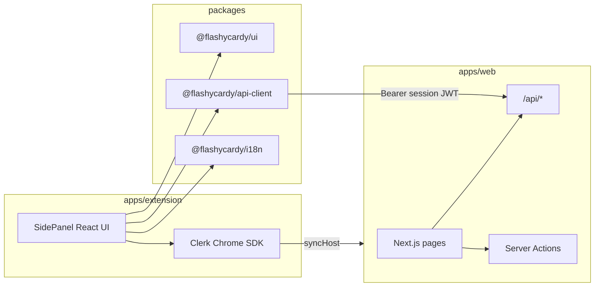

# Chrome Extension — Web Parity Plan

## Goals

Ship a **side-panel** Chrome extension with **feature parity** to [`apps/web`](apps/web): auth, dashboard (decks CRUD + sort/pagination), deck detail (cards CRUD + sort), study mode, analytics, settings (language), Pro gates (AI cards, document deck), and pricing upgrade path.

**Out of scope for v1 (acceptable gaps):** dashboard Joyride tour, MCP tools, server-rendered marketing home page (extension shows sign-in / “open web” instead).

---

## Current state

| Layer | What exists |
|-------|-------------|
| **Web routes** | `/`, `/dashboard`, `/decks/[deckUuid]`, `/decks/[deckUuid]/study`, `/analytics`, `/pricing` |
| **REST API** | Full deck/card/study-session CRUD under [`apps/web/src/app/api/`](apps/web/src/app/api/) — documented in [`apps/docs/content/reference/rest-api.mdx`](apps/docs/content/reference/rest-api.mdx) |
| **Web-only mutations** | [`generateCardsAction`](apps/web/src/actions/cards.ts), [`createDeckFromDocumentAction`](apps/web/src/actions/decks.ts) — **no REST routes yet** |
| **Shared packages** | Empty ([`packages/.gitkeep`](packages/.gitkeep)) |
| **Extension** | None |



---

## Architecture decisions (locked in)

1. **Shell:** MV3 **default side panel** (`side_panel` in manifest); optional “Open in browser” links to production web for pricing (`PricingTable` is web-only per Clerk billing rules).
2. **Auth:** [`@clerk/chrome-extension`](https://clerk.com/docs/references/chrome-extension/overview) with **`syncHost`** pointing at the deployed web origin (e.g. `https://<your-vercel-domain>`). Users sign in on the web (OAuth/SAML/email-link supported there); extension reuses session. Side panel uses `createClerkClient({ background: true })` for token refresh.
3. **Data:** Extension is a **REST client only** — no Drizzle, no Server Actions, no `useEffect` fetch to ad-hoc routes. Aligns with [`public-api.mdc`](.cursor/rules/public-api.mdc).
4. **Code sharing:** Extract **`@flashycardy/ui`**, **`@flashycardy/api-client`**, **`@flashycardy/i18n`**; move client-heavy screens (study, create-deck dialog, deck/card dialogs) into **`@flashycardy/features`** as props-driven components web and extension both mount.

---

## Phase 1 — Monorepo packages and API hardening

### 1a. `packages/api-client`

- Typed client for every route in the REST summary table ([`rest-api.mdx`](apps/docs/content/reference/rest-api.mdx)).
- `createFlashycardyClient({ baseUrl, getToken })` where `getToken` wraps Clerk `session.getToken()`.
- Parse `{ data }` / `{ error }` envelope; throw typed `ApiError` on non-2xx.
- Pagination helpers matching `page` / `pageSize` + `meta` / `links`.

### 1b. `packages/i18n`

- Re-export [`messages/en.json`](apps/web/messages/en.json) and [`messages/es.json`](apps/web/messages/es.json).
- `IntlProvider` wrapper for extension (client-only `next-intl` or `react-intl` — pick one stack for extension; **recommend `next-intl` client provider** to keep message keys identical).
- Shared [`normalizeLocale`](apps/web/src/i18n/config.ts) + supported locale list.

### 1c. `packages/ui`

- Move [`apps/web/src/components/ui/*`](apps/web/src/components/ui) here.
- Shared `globals.css` tokens / Tailwind v4 preset consumed by web + extension builds.
- Keep shadcn imports pointing at `@flashycardy/ui` per project rules.

### 1d. `packages/features`

- Extract **client** modules (accept data + callbacks, no `next/navigation`):
  - `StudySession` (from [`study-client.tsx`](apps/web/src/app/decks/[deckUuid]/study/study-client.tsx)) — replace `saveStudySessionAction` with injected `onSaveSession`.
  - `CreateDeckDialog`, deck/card edit/delete dialogs (from `apps/web/src/app/dashboard` and `decks/[deckUuid]`).
  - Optional: `DeckSortSelect`, `CardSortSelect`.
- Web pages become thin: Server Component fetches via query helpers → passes props + server actions **or** API callbacks.

### 1e. Close REST gaps in `apps/web` (required for parity)

Add routes mirroring existing Server Action logic (delegate to same `@/db/queries/*` + AI helpers):

| New route | Mirrors | Gates |
|-----------|---------|-------|
| `POST /api/decks/[deckUuid]/generate-cards` | `generateCardsAction` | `ai_flashcard_generation` |
| `POST /api/decks/from-document` | `createDeckFromDocumentAction` | `document_deck_generation`, body `{ fileBase64, fileName }` |
| MCP tools + [`register-tools.ts`](apps/web/src/lib/mcp/register-tools.ts) | per [`mcp-route-handlers.mdc`](.cursor/rules/mcp-route-handlers.mdc) | same as REST |

**Auth hardening:** Extend [`withAuth`](apps/web/src/lib/api/with-auth.ts) to accept `Authorization: Bearer` session JWTs (reuse pattern from [`verify-mcp-token.ts`](apps/web/src/lib/mcp/verify-mcp-token.ts) `authenticateRequest(..., { acceptsToken: "session_token" })`). Today MCP has this; standard REST handlers rely on cookie `auth()` only — extension calls will fail without this change.

**Locale:** No new REST route needed if extension settings call **Clerk user metadata** via `@clerk/chrome-extension` `useUser()` — same as [`settings-page.tsx`](apps/web/src/components/settings-page.tsx).

Update [`apps/docs/content/reference/rest-api.mdx`](apps/docs/content/reference/rest-api.mdx) (Diátaxis reference) for new routes.

---

## Phase 2 — `apps/extension` scaffold

### Tooling

- **WXT** or **Vite + `@crxjs/vite-plugin`** (React 19, TypeScript, Tailwind 4).
- Package name: `@flashycardy/extension`.
- Wire into root [`package.json`](package.json) / [`turbo.json`](turbo.json): `dev:extension`, `build:extension`, `lint:extension`.

### Manifest (MV3)

```json
{
  "manifest_version": 3,
  "name": "FlashyCardy",
  "version": "0.1.0",
  "permissions": ["storage", "sidePanel"],
  "side_panel": { "default_path": "sidepanel.html" },
  "background": { "service_worker": "background.js" },
  "action": { "default_title": "FlashyCardy" }
}
```

- `chrome.sidePanel.setPanelBehavior({ openPanelOnActionClick: true })` in background.
- **Host permissions:** production API origin + `syncHost` web origin only (no `<all_urls>`).

### Clerk setup (Dashboard + env)

- Create **Chrome Extension** application in Clerk; add extension ID(s) for dev unpacked + prod store build.
- Env in extension (via `dotenvx` or WXT `import.meta.env`):
  - `VITE_CLERK_PUBLISHABLE_KEY`
  - `VITE_API_BASE_URL` (e.g. `https://flashycardy.vercel.app`)
  - `VITE_SYNC_HOST` (same origin as web, no trailing slash)
- Document in [`apps/docs`](apps/docs) how-to: local dev with unpacked extension + `pnpm dev` web on localhost as sync host.

### App shell (side panel)

- `ClerkProvider` (chrome-extension) wrapping `IntlProvider` + shared `TooltipProvider`.
- Router: lightweight **React Router** (or WXT file-based routes) mapping:
  - `/` → signed-out gate (sign in via web CTA + sync status)
  - `/dashboard`
  - `/decks/:deckUuid`
  - `/decks/:deckUuid/study`
  - `/analytics`
  - `/settings`
- Header: wordmark + Clerk `UserButton` (reuse patterns from [`app-user-button.tsx`](apps/web/src/components/app-user-button.tsx) where SDK allows; pricing link opens `chrome.tabs.create({ url: `${syncHost}/pricing` })`).

---

## Phase 3 — Feature implementation (parity checklist)

| Web feature | Extension implementation |
|-------------|---------------------------|
| Dashboard list, sort, pagination | `GET /api/decks` + client sort; `GET /api/study-sessions/counts` for session badges |
| Free deck limit (3) | `GET /api/decks/count` + Clerk `has({ feature: "unlimited_decks" })` |
| Create / edit / delete deck | `POST/PATCH/DELETE` deck routes + shared `CreateDeckDialog` |
| Document deck (Pro) | `POST /api/decks/from-document` + file picker in dialog |
| Deck detail + cards table | `GET /api/decks/[uuid]` (paginate cards) + shared dialogs |
| AI generate cards (Pro) | `POST .../generate-cards` + `<Show when={{ feature: "ai_flashcard_generation" }}>` |
| Study mode | Shared `StudySession`; save via `POST /api/study-sessions` |
| Analytics | `GET /api/study-sessions` (paginate or fetch all pages) |
| Settings / language | Clerk metadata update + `router.refresh` equivalent (reload messages) |
| Pricing / upgrade | Open web `/pricing` tab (Clerk `PricingTable` stays on web) |
| i18n en/es | `@flashycardy/i18n` messages |

**Billing UI:** Use Clerk `<Show>` in extension the same way as web ([`generate-cards-button.tsx`](apps/web/src/app/decks/[deckUuid]/generate-cards-button.tsx), [`dashboard/page.tsx`](apps/web/src/app/dashboard/page.tsx)).

---

## Phase 4 — Refactor `apps/web` to consume packages

Order of migration (minimize breakage):

1. `@flashycardy/ui` — update imports in web; run existing Vitest component tests.
2. `@flashycardy/api-client` — optional for web (web can keep Server Components + actions); use in any future client-only code paths.
3. `@flashycardy/features` — swap study + dialogs; keep Server Actions in web adapters, API callbacks in extension adapters.

Example adapter pattern:

```tsx
// apps/web — study page
<StudySession
  deckUuid={deck.uuid}
  cards={cards}
  onSaveSession={(input) => saveStudySessionAction(input)}
/>

// apps/extension — study route
<StudySession
  deckUuid={deckUuid}
  cards={cards}
  onSaveSession={async (input) => {
    await client.studySessions.create(input);
  }}
/>
```

---

## Phase 5 — Testing, CI, Chrome Web Store

### Tests

- **Unit:** Move/adapt existing Vitest tests for extracted components under `packages/features` (study-client tests already exist).
- **Extension smoke:** Playwright or manual checklist — sign in via sync host, create deck, study, see analytics.
- **API:** Existing route tests + new tests for `generate-cards` and `from-document` routes.

### CI

- `turbo run build lint test` includes `@flashycardy/extension` producing `dist/extension.zip`.
- Artifact upload for manual load / store submission.

### Chrome Web Store

- Privacy policy URL, single purpose description, screenshots (side panel: dashboard + study).
- Separate Clerk extension IDs for **dev** vs **published** builds.
- Versioning aligned with web (`0.1.0` initial).

---

## New Cursor rule

Add [`.cursor/rules/chrome-extension.mdc`](.cursor/rules/chrome-extension.mdc) (`globs: apps/extension/**`):

- REST + `api-client` only (no Server Actions / Drizzle in extension).
- Clerk chrome-extension SDK + syncHost; no custom auth.
- shadcn via `@flashycardy/ui` only.
- Pro features gated with Clerk `has()` / `<Show>`.
- When adding REST routes for extension, update MCP + docs.

---

## Risk notes

| Risk | Mitigation |
|------|------------|
| REST `withAuth` ignores Bearer today | Phase 1e `withAuth` enhancement + integration test |
| Side panel OAuth redirects unsupported | Rely on **syncHost** + web sign-in; show clear “Sign in on flashycardy.com” state |
| Large document upload in extension | Same 10MB base64 cap; consider `chrome.storage` progress UI |
| Shared package Tailwind/version drift | Single `tailwind` preset package export |
| `PricingTable` in extension | Open web tab only (by design) |

---

## Suggested implementation order

1. Packages scaffold (`ui`, `i18n`, `api-client`) + `withAuth` Bearer support  
2. REST gap routes + MCP parity + docs  
3. Extract `features` (study + dialogs) and migrate web  
4. `apps/extension` shell + Clerk sync + dashboard  
5. Deck detail, study, analytics, settings  
6. Pro routes (AI + document) + store packaging  

Estimated scope: **~2–3 focused PRs** for foundation + API, **~2–3 PRs** for extension UI parity, plus docs/store assets.
