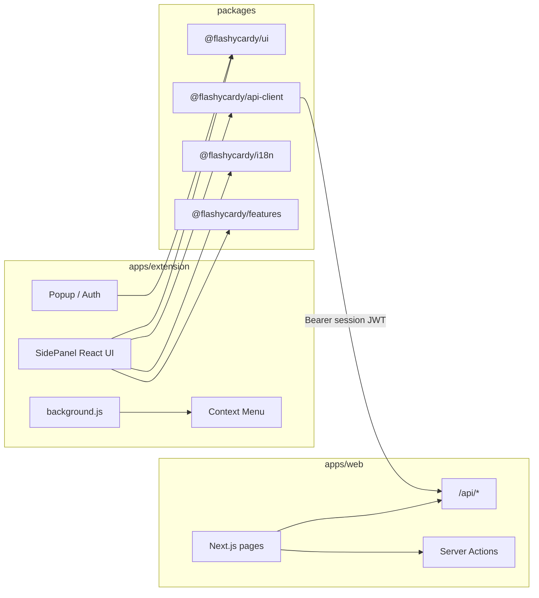

# Chrome Extension — Web Parity Plan (PRD-aligned)

## Goals

Ship a **side-panel** Chrome extension with **feature parity** to [`apps/web`](apps/web): auth (including direct sign-up from the extension), dashboard (decks CRUD + sort/pagination), deck detail (cards CRUD + sort), study mode, analytics, settings (language), Pro gates (AI cards, document deck, page-content deck), pricing upgrade path, and a context-menu "Save selection as flashcard" shortcut.

**Out of scope for v1 (acceptable gaps):** dashboard Joyride tour, server-rendered marketing home page (extension shows sign-in instead), MCP session streaming (extension uses HTTP transport only).

---

## Current state

| Layer | What exists |
|-------|-------------|
| **Web routes** | `/`, `/dashboard`, `/decks/[deckUuid]`, `/decks/[deckUuid]/study`, `/analytics`, `/pricing` |
| **REST API** | Full deck/card/study-session CRUD under [`apps/web/src/app/api/`](apps/web/src/app/api/) — documented in [`apps/docs/content/reference/rest-api.mdx`](apps/docs/content/reference/rest-api.mdx) |
| **Web-only mutations** | [`generateCardsAction`](apps/web/src/actions/cards.ts), [`createDeckFromDocumentAction`](apps/web/src/actions/decks.ts) — **no REST routes yet** |
| **Page-content deck generation** | Not implemented anywhere — new feature |
| **Shared packages** | Empty ([`packages/.gitkeep`](packages/.gitkeep)) |
| **Extension** | None |



---

## Architecture decisions (locked in)

1. **Shell:** MV3 **default side panel** (`side_panel` in manifest); optional "Open in browser" links to production web for pricing (`PricingTable` is web-only per Clerk billing rules).
2. **Auth:** [`@clerk/chrome-extension`](https://clerk.com/docs/references/chrome-extension/overview) using Clerk's **OAuth redirect flow** — clicking "Sign in" or "Sign up" opens Clerk's hosted auth page in a new tab via `chrome.identity` / a redirect URI registered under `chrome-extension://<id>/`. New users can sign up directly without visiting the web app first. The resulting session token is stored in `chrome.storage.local`. Token refresh runs in the background service worker via `createClerkClient({ background: true })`. `syncHost` is retained as a secondary fast-path for users who are already signed in to the web app — but it is not the only path.
3. **Data:** Extension is a **REST client only** — no Drizzle, no Server Actions, no ad-hoc fetch. Aligns with `public-api.mdc`.
4. **Code sharing:** Extract **`@flashycardy/ui`**, **`@flashycardy/api-client`**, **`@flashycardy/i18n`**; move client-heavy screens (study, create-deck dialog, deck/card dialogs) into **`@flashycardy/features`** as props-driven components both web and extension mount.
5. **Page-content generation:** A new `POST /api/decks/from-page` REST route and matching `generate_deck_from_page_content` MCP tool accept raw text from the active tab (extracted via `chrome.scripting.executeScript`) instead of a base64 file, and run the same GPT-4.1-nano pipeline as `createDeckFromDocumentAction`.
6. **Context menu:** A `chrome.contextMenus` entry wired in `background.js` opens the side panel and pre-fills the Add Card form front field with the selected text.

---

## Phase 1 — Monorepo packages and API hardening

**Goal:** All shared code extracted; REST layer ready to serve a Bearer-authenticated client. No extension UI yet. Zero breakage to `apps/web`.

### 1a. `packages/api-client`

- Typed client for every existing route in [`rest-api.mdx`](apps/docs/content/reference/rest-api.mdx).
- `createFlashycardyClient({ baseUrl, getToken })` where `getToken` wraps Clerk `session.getToken()`.
- Parse `{ data }` / `{ error }` envelope; throw typed `ApiError` on non-2xx.
- Pagination helpers matching `page` / `pageSize` + `meta` / `links`.

### 1b. `packages/i18n`

- Re-export [`messages/en.json`](apps/web/messages/en.json) and [`messages/es.json`](apps/web/messages/es.json).
- `IntlProvider` wrapper for extension (client-only `next-intl` provider to keep message keys identical).
- Shared `normalizeLocale` + supported locale list.
- **Add new keys** for extension-only strings (see Phase 6):
  - `Extension.generateFromPage`, `Extension.generatingFromPage`
  - `Extension.originUnsupported`, `Extension.pageTooShort`, `Extension.generateFailed`
  - `Extension.saveSelection`, `Extension.openFlashycardy`, `Extension.signInToSave`

### 1c. `packages/ui`

- Move [`apps/web/src/components/ui/*`](apps/web/src/components/ui) here.
- Shared `globals.css` tokens / Tailwind v4 preset consumed by web + extension builds.
- Keep shadcn imports pointing at `@flashycardy/ui`.

### 1d. `packages/features`

- Extract **client** modules (accept data + callbacks, no `next/navigation`):
  - `StudySession` (from [`study-client.tsx`](apps/web/src/app/decks/[deckUuid]/study/study-client.tsx)) — replace `saveStudySessionAction` with injected `onSaveSession`.
  - `CreateDeckDialog`, deck/card edit/delete dialogs.
  - `AddCardForm` — new thin wrapper around the existing Add Card dialog, accepting an optional `prefillFront` prop (needed by Phase 7 context-menu flow).
  - Optional: `DeckSortSelect`, `CardSortSelect`.
- Web pages become thin: Server Component fetches → passes props + server actions **or** API callbacks.

### 1e. Close REST gaps in `apps/web`

**`withAuth` Bearer hardening** (prerequisite for all extension REST calls):

Extend [`withAuth`](apps/web/src/lib/api/with-auth.ts) to accept `Authorization: Bearer <session_jwt>` in addition to cookie-based `auth()`. Reuse the `authenticateRequest(..., { acceptsToken: "session_token" })` pattern already present in [`verify-mcp-token.ts`](apps/web/src/lib/mcp/verify-mcp-token.ts). Today, MCP has Bearer support; standard REST handlers rely on cookie `auth()` only — extension calls will return 401 without this change.

Add integration test: a REST request with a session JWT Bearer token returns 200 on a cookie-auth-only route today.

**New REST routes** mirroring existing Server Action logic:

| New route | Mirrors | Feature flag |
|-----------|---------|--------------|
| `POST /api/decks/[deckUuid]/generate-cards` | `generateCardsAction` | `ai_flashcard_generation` |
| `POST /api/decks/from-document` | `createDeckFromDocumentAction` | `document_deck_generation`, body `{ fileBase64, fileName }` |

Register matching MCP tools in [`register-tools.ts`](apps/web/src/lib/mcp/register-tools.ts) per `mcp-route-handlers.mdc`. Update [`rest-api.mdx`](apps/docs/content/reference/rest-api.mdx).

**Tests:** mirror existing `decks.test.ts` patterns for both new routes.

---

## Phase 2 — `generate_deck_from_page_content` (new feature)

**Goal:** Ship the page-content deck generation capability as a first-class backend feature before the extension exists, so it can be tested independently via REST and MCP.

This is a net-new feature not present in `apps/web`. It accepts plain text extracted from a browser tab instead of a base64-encoded file, and runs the same GPT-4.1-nano generation pipeline as `createDeckFromDocumentAction`.

### 2a. New REST route: `POST /api/decks/from-page`

**Request body schema (Zod):**
```ts
z.object({
  pageText:  z.string().min(100).max(50_000),  // visible text from the tab
  pageUrl:   z.string().url().optional(),       // used in deck description attribution
  pageTitle: z.string().max(255).optional(),    // seed for deck title generation
})
```

**Behavior:**
1. Auth via `withAuth` (Bearer + cookie — uses the hardened `withAuth` from Phase 1e).
2. Check `document_deck_generation` Clerk feature flag — 403 if absent.
3. Check `unlimited_decks` flag / free deck limit — same logic as `createDeckFromDocumentAction`.
4. Call GPT-4.1-nano (`generateText` + `Output.object`) with the same system prompt and output schema (`title`, `description`, `cards[20]`) as `createDeckFromDocumentAction`. Pass `pageTitle` as a hint in the prompt.
5. `insertDeckWithCards` — same DB helper as the document action.
6. Return `{ data: { deckUuid } }`.

**Error responses (mirrors `createDeckFromDocumentAction`):**
- `pageText` under 100 chars → `{ error: "Page text is too short to generate flashcards." }`
- Feature flag absent → `{ error: "Document-based deck generation requires a Pro plan." }`
- Deck limit reached → `{ error: "You've reached the 3-deck limit on the free plan." }`
- AI failure → `{ error: "Could not generate a deck from this page. Try again." }`

### 2b. New MCP tool: `generate_deck_from_page_content`

Register in [`register-tools.ts`](apps/web/src/lib/mcp/register-tools.ts):

```ts
server.registerTool(
  "generate_deck_from_page_content",
  {
    title: "Generate deck from page content",
    description:
      "Creates a deck with 20 AI-generated flashcards from plain page text " +
      "(Pro: document_deck_generation feature flag required).",
    inputSchema: z.object({
      pageText:  z.string().min(100).max(50_000),
      pageUrl:   z.string().url().optional(),
      pageTitle: z.string().max(255).optional(),
    }),
  },
  async (args, extra) => {
    const ctx = requireToolContext(extra);
    if (!ctx) return mcpToolError("Unauthorized");
    return runGenerateDeckFromPageContent(ctx, args);
  }
);
```

Implement `runGenerateDeckFromPageContent` in `apps/web/src/lib/mcp/tools/generate-deck-from-page-content.ts` — delegates to the same service layer called by the REST route.

### 2c. i18n additions

Add error-string keys to `messages/en.json` and `messages/es.json` under `Actions`:
- `pageTooShort`
- `pageGenFailed`

### 2d. Docs

Update `rest-api.mdx` with the new route. Add a note in `register-tools.ts` JSDoc.

### 2e. Tests

- Unit tests in `decks.test.ts` pattern: unauthorized, missing feature flag, deck limit, text too short, AI failure, success.
- MCP tool test in a new `generate-deck-from-page-content.test.ts` mirroring existing MCP tool tests.

---

## Phase 3 — Refactor `apps/web` to consume packages

**Goal:** Web app migrated to shared packages. Proves packages work in production before the extension depends on them.

Order of migration (minimize breakage):

1. `@flashycardy/ui` — update imports in web; run existing Vitest component tests.
2. `@flashycardy/api-client` — optional for web (web keeps Server Components + actions); used in any future client-only code paths.
3. `@flashycardy/features` — swap study + dialogs; keep Server Actions in web adapters, API callbacks in extension adapters.

Adapter pattern:

```tsx
// apps/web — study page
<StudySession
  deckUuid={deck.uuid}
  cards={cards}
  onSaveSession={(input) => saveStudySessionAction(input)}
/>

// apps/extension — study route
<StudySession
  deckUuid={deckUuid}
  cards={cards}
  onSaveSession={async (input) => { await client.studySessions.create(input); }}
/>
```

---

## Phase 4 — `apps/extension` scaffold + auth

**Goal:** A loadable extension shell with working sign-in, sign-up, and sign-out. No feature screens yet.

### Tooling

**Chosen: WXT + Vite** (React 19, TypeScript, Tailwind 4).

Next.js was evaluated and ruled out for this surface. The blocker is structural and cannot be worked around: Next.js static exports (`output: 'export'`) inject `self.__next_f.push(...)` inline scripts for hydration bootstrapping. MV3 enforces `script-src 'self'` on all extension pages and explicitly disallows `'unsafe-inline'` — Chrome rejects it even if declared in `content_security_policy.extension_pages`. There is no supported mechanism in Next.js to externalise these hydration scripts in a static export, and nonce-based solutions require a running server (incompatible with the extension context). This is a known open issue in the Next.js repo with no resolution path for the static-export + strict-CSP combination.

WXT is the right tool for this surface:
- First-class MV3 support: service worker, side panel, multi-entry HTML pages (popup, sidepanel, auth-callback), and `web-ext` dev reload all work out of the box.
- Vite output is plain `<script src="...">` tags — no inline bootstrapping, fully CSP-compliant.
- React, TypeScript, and Tailwind integrate identically to `apps/web`.
- All shared packages (`@flashycardy/ui`, `@flashycardy/features`, `@flashycardy/api-client`, `@flashycardy/i18n`) are framework-agnostic and consumed the same way in both apps.

The extension therefore runs React but **not** the Next.js framework. `apps/web` remains the only Next.js app in the monorepo.

- Package name: `@flashycardy/extension`.
- Wire into root `package.json` / `turbo.json`: `dev:extension`, `build:extension`, `lint:extension`.

### Manifest (MV3)

```json
{
  "manifest_version": 3,
  "name": "FlashyCardy",
  "version": "0.1.0",
  "permissions": ["storage", "sidePanel", "activeTab", "scripting", "contextMenus"],
  "host_permissions": [
    "https://flashycardy.app/*",
    "https://*.clerk.accounts.dev/*"
  ],
  "side_panel": { "default_path": "sidepanel.html" },
  "background": { "service_worker": "background.js" },
  "action": { "default_title": "FlashyCardy" }
}
```

Note: `activeTab` and `scripting` are required for Phase 6 (page-content generation). `contextMenus` is required for Phase 7. Both are declared here so the manifest is stable and users are not re-prompted for permissions on an update.

### Clerk setup

- Create **Chrome Extension** application in Clerk dashboard; register extension ID(s) for dev unpacked + prod store builds.
- Env (via `dotenvx` or WXT `import.meta.env`):
  - `VITE_CLERK_PUBLISHABLE_KEY`
  - `VITE_API_BASE_URL` (e.g. `https://flashycardy.vercel.app`)
  - `VITE_SYNC_HOST` (same origin as web, for existing-session fast-path)

### Auth screens (popup / side panel gate)

- `ClerkProvider` (chrome-extension) wrapping `IntlProvider` + `TooltipProvider`.
- Unauthenticated state renders a sign-in / sign-up screen with:
  - **"Sign in"** button → `clerk.openSignIn()` via Clerk's hosted auth page (OAuth redirect to `chrome-extension://<id>/auth-callback.html`).
  - **"Create account"** button → `clerk.openSignUp()` — same redirect URI.
  - `syncHost` fast-path: on popup open, check `chrome.storage.local` for an existing Clerk session token. If found, skip to dashboard. This means users already signed in on the web app get a seamless experience without going through the OAuth redirect.
- On successful auth, token stored in `chrome.storage.local`; popup transitions to dashboard.
- Sign-out clears storage and returns to the sign-in screen.
- No passwords are entered in the extension — all credential entry happens on Clerk's hosted page.

### Background service worker

- `chrome.sidePanel.setPanelBehavior({ openPanelOnActionClick: true })` on `runtime.onInstalled`.
- Token refresh loop using `createClerkClient({ background: true })`.
- Placeholder `chrome.contextMenus.create` call (wired fully in Phase 7).

### App router

Lightweight **React Router** mapping:

| Path | Component |
|------|-----------|
| `/` | Auth gate (redirects to `/dashboard` if signed in) |
| `/dashboard` | Deck list |
| `/decks/:deckUuid` | Deck detail |
| `/decks/:deckUuid/study` | Study session |
| `/analytics` | Session history |
| `/settings` | Language preference |

---

## Phase 5 — Feature screens (parity)

**Goal:** Full web-parity screens inside the extension using shared packages. Pricing remains web-only.

| Web feature | Extension implementation |
|-------------|--------------------------|
| Dashboard list, sort, pagination | `GET /api/decks` + client sort; `GET /api/study-sessions/counts` for session badges |
| Free deck limit (3) | `GET /api/decks/count` + Clerk `has({ feature: "unlimited_decks" })` |
| Create / edit / delete deck | `POST/PATCH/DELETE` deck routes + shared `CreateDeckDialog` from `@flashycardy/features` |
| Document deck (Pro) | `POST /api/decks/from-document` + file picker in `CreateDeckDialog` |
| Deck detail + cards table | `GET /api/decks/[uuid]` (paginated) + shared dialogs |
| AI generate cards (Pro) | `POST .../generate-cards` + `<Show when={{ feature: "ai_flashcard_generation" }}>` |
| Study mode | Shared `StudySession`; save via `POST /api/study-sessions` |
| Analytics | `GET /api/study-sessions` (paginate all pages) |
| Settings / language | Clerk metadata update + reload messages |
| Pricing / upgrade | Open `${syncHost}/pricing` tab (`chrome.tabs.create`) |
| i18n en/es | `@flashycardy/i18n` messages |

Header: wordmark + Clerk `UserButton`; plan badge for Free users with "Go Pro" link.

---

## Phase 6 — "Generate from this page" (extension-only Pro feature)

**Goal:** Wire the new `POST /api/decks/from-page` backend (Phase 2) into the extension UI.

### UI

- A **"Generate from this page"** button appears in the extension popup header on all web pages.
- The button is **disabled with a tooltip** on restricted origins: `chrome://`, `chrome-extension://`, `file://`, and `about:*`. Check `chrome.tabs.query({ active: true, currentWindow: true })` and inspect the tab URL.
- The button is hidden (not just disabled) for Free users (check `has({ feature: "document_deck_generation" })`); replaced with a "Pro feature — Go Pro" prompt.

### Page text extraction

On click:
1. Call `chrome.scripting.executeScript({ target: { tabId }, func: () => document.body.innerText })`.
2. Trim whitespace; if result is under 100 characters, surface an inline error: "This page doesn't have enough text to generate flashcards."
3. Also read `document.title` from the tab metadata (`chrome.tabs.get`) to pass as `pageTitle`.
4. POST `{ pageText, pageUrl: tab.url, pageTitle: tab.title }` to `POST /api/decks/from-page` via `api-client`.
5. Show a loading spinner with "Generating flashcards…" label.
6. On success, navigate the side panel to the new deck's detail route.
7. On error, surface the API error message inline (deck limit, AI failure, etc.).

### i18n strings (from Phase 1b additions)

- `Extension.generateFromPage` — "Generate from this page"
- `Extension.generatingFromPage` — "Generating flashcards…"
- `Extension.originUnsupported` — "Can't generate from this type of page"
- `Extension.pageTooShort` — "This page doesn't have enough text to generate flashcards."
- `Extension.generateFailed` — "Could not generate flashcards. Try again."

### Tests

- Unit test for the origin-guard logic (pure function, no Chrome API needed).
- Integration test: mock `chrome.scripting.executeScript`, assert correct payload sent to `POST /api/decks/from-page`.

---

## Phase 7 — Context menu "Save selection as flashcard"

**Goal:** Let users right-click any selected text on any page and send it directly to a deck as a card front.

### Background service worker additions

On `runtime.onInstalled`:

```ts
chrome.contextMenus.create({
  id: "save-to-flashycardy",
  title: "Save to FlashyCardy",
  contexts: ["selection"],
});
```

On `contextMenus.onClicked`:

1. Store `info.selectionText` in `chrome.storage.session` under key `prefill-front`.
2. Open the side panel (`chrome.sidePanel.open({ tabId })`) and navigate to `/decks/new-card`.

### Extension side panel: `/decks/new-card` route

- On mount, read `prefill-front` from `chrome.storage.session` and clear it.
- Render the shared `AddCardForm` from `@flashycardy/features` with `prefillFront` prop set.
- User completes the Back field, picks a deck from a `<select>` populated by `GET /api/decks`.
- Submits via `POST /api/decks/[deckUuid]/cards`.
- On success, navigate to the deck detail route and show a success toast.
- **Unauthenticated guard:** if no session, show sign-in screen with banner: "Sign in to save this card."

### i18n strings

- `Extension.saveSelection` — "Save to FlashyCardy"
- `Extension.signInToSave` — "Sign in to save this card."

### Tests

- Unit test for `runtime.onInstalled` context menu registration.
- Integration test: `onClicked` handler stores `selectionText` and opens side panel.
- Component test: `AddCardForm` renders with `prefillFront` pre-populated.

---

## Phase 8 — Testing, CI, Chrome Web Store

### Tests

- **Unit:** Adapted Vitest tests for extracted packages/features components; new tests for Phase 2 (page-content route + MCP tool), Phase 6 (origin guard, scripting integration), Phase 7 (context menu handler, `AddCardForm` pre-fill).
- **Extension smoke (Playwright):** Chrome extension mode (`--load-extension`), covering: sign-up (new user, no prior web session), sign-in (existing user via OAuth redirect), `syncHost` fast-path (existing web session), create deck manually, generate deck from page, save selection as flashcard, study session, analytics.
- **API regression:** Existing route tests extended for new routes (`from-page`, `from-document`, `generate-cards`) + `withAuth` Bearer integration test.

### CI

- `turbo run build lint test` includes `@flashycardy/extension` producing `dist/extension.zip`.
- Artifact uploaded as a CI build artifact for manual load and store submission.

### Chrome Web Store

- Privacy policy URL, single-purpose description, screenshots (side panel: sign-up, dashboard, study, "Generate from this page").
- Separate Clerk extension IDs for **dev** (unpacked) vs **published** (store) builds.
- Versioning aligned with web (`0.1.0` initial).

---

## New Cursor rules

### `.cursor/rules/chrome-extension.mdc` (`globs: apps/extension/**`)

- REST + `api-client` only (no Server Actions / Drizzle in extension).
- Clerk `@clerk/chrome-extension` SDK; OAuth redirect for auth (not `syncHost`-only).
- shadcn via `@flashycardy/ui` only.
- Pro features gated with Clerk `has()` / `<Show>`.
- When adding REST routes for extension, update MCP + docs.
- `activeTab` / `scripting` used only on explicit user action — never on page load.
- All `chrome.storage` writes use `chrome.storage.local` for tokens, `chrome.storage.session` for transient pre-fill state.

---

## Risk notes

| Risk | Mitigation |
|------|------------|
| REST `withAuth` ignores Bearer today | Phase 1e `withAuth` enhancement + integration test before any extension REST call |
| OAuth redirect URI in extension requires Clerk dashboard config | Document in Phase 4 setup; register both dev + prod extension IDs before testing |
| `syncHost` fast-path breaks if web app origin changes | `VITE_SYNC_HOST` env var; document in extension README |
| Page text extraction: large pages exceed 50k char limit | Client-side truncation before POST; surface a warning if truncated |
| `chrome.scripting` requires `activeTab` to be a real web page | Origin guard (Phase 6) prevents calls on `chrome://` and `file://` URLs |
| Context menu `selectionText` lost if side panel was already open | Use `chrome.storage.session` as the handoff; clear after first read |
| Large document upload in extension | Same 10 MB base64 cap as web; progress UI in dialog |
| Shared package Tailwind/version drift | Single `tailwind` preset package export |
| `PricingTable` unavailable in extension | Open web tab only — by design, documented in Cursor rule |
| New user sign-up via extension without web app | Fully supported via OAuth redirect (Phase 4); `syncHost` is additive fast-path only |

---

## Implementation order

| Phase | Deliverable | Risk level |
|-------|-------------|------------|
| 1 | Packages scaffold + `withAuth` Bearer + REST gap routes | Low — additive to existing backend |
| 2 | `from-page` REST route + `generate_deck_from_page_content` MCP tool | Low — new endpoint, no existing code changed |
| 3 | Migrate `apps/web` to consume packages | Medium — refactor with test coverage |
| 4 | Extension shell + Clerk OAuth auth screens | Medium — new Clerk app config required |
| 5 | Feature screens (dashboard → analytics) | Low — reuses shared packages from Phase 3 |
| 6 | "Generate from this page" button + scripting | Low — backend done in Phase 2; UI is additive |
| 7 | Context menu "Save selection as flashcard" | Low — isolated to background.js + one new route |
| 8 | CI, store packaging, Playwright smoke tests | Low — infrastructure only |

Estimated scope: **~2 PRs** for Phase 1–2 (backend hardening + new route), **~1 PR** for Phase 3 (web migration), **~2–3 PRs** for Phases 4–5 (extension shell + screens), **~1 PR** for Phases 6–7 (new extension features), **~1 PR** for Phase 8 (CI + store).