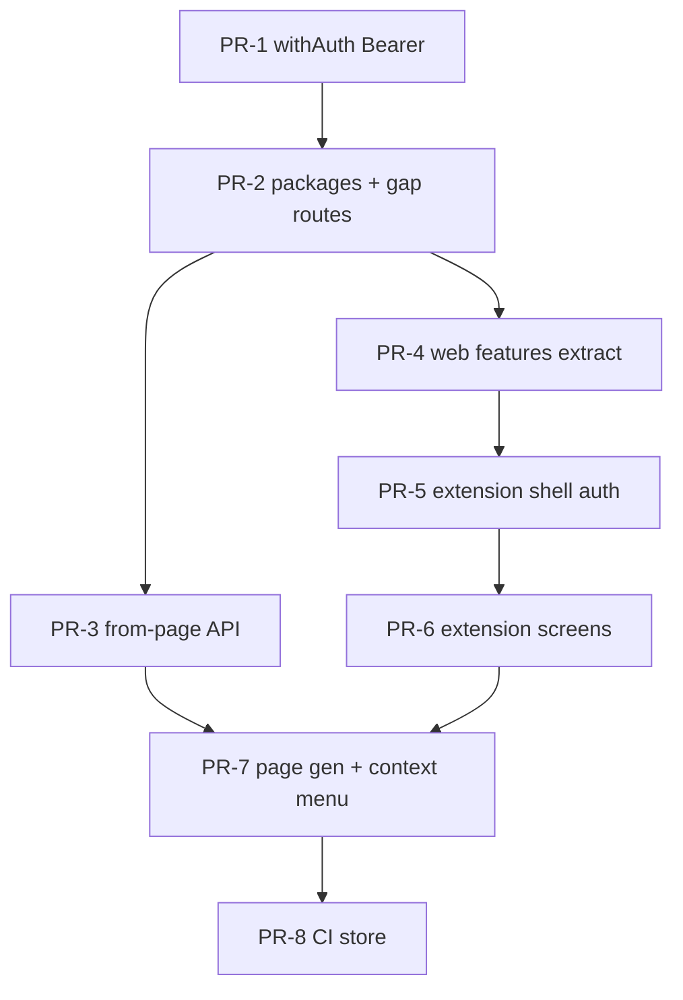

# Chrome Extension Parity — Actionable Plan

**Source:** [chrome_extension_parity_8337cdf6.plan_claude.plan.md](./chrome_extension_parity_8337cdf6.plan_claude.plan.md)

**North star:** MV3 side-panel extension (`apps/extension`) with web feature parity, shared monorepo packages, REST-only data layer, Clerk OAuth redirect auth (+ `syncHost` fast-path), “Generate from this page,” and context-menu “Save selection as flashcard.”

**Out of scope (v1):** Dashboard Joyride, marketing home in extension, MCP streaming in extension.

---

## Prerequisites (do once, before PR-5)

| Item | Done when |
|------|-----------|
| Clerk instance configured for Chrome Extension | Native API on; dev + prod extension IDs in `allowed_origins` |
| OAuth / redirect URLs | `ClerkProvider` redirect props + `auth-callback.html` entry load without error |
| Env vars | `apps/extension/.env.development` (and `.env.production` later) committed to team docs, not git |
| Billing features | All plan feature slugs exist in Clerk Billing |

### Clerk Chrome Extension setup (full steps)

Clerk does **not** create a second “Chrome Extension application.” You use the **same Clerk instance** as [`apps/web`](apps/web) (`NEXT_PUBLIC_CLERK_PUBLISHABLE_KEY` / `CLERK_SECRET_KEY` in root `.env`). Extension support is dashboard configuration + `allowed_origins` + env vars.

Official references: [Chrome Extension quickstart](https://clerk.com/docs/chrome-extension/getting-started/quickstart), [Deploy extension to production](https://clerk.com/docs/guides/development/deployment/chrome-extension), [Sync Host](https://clerk.com/docs/guides/sessions/sync-host), [Consistent CRX ID](https://clerk.com/docs/guides/development/configure-consistent-crx-id).

---

#### Part A — Dashboard (development instance)

Use the **Development** instance in the Clerk Dashboard (same one as local `pk_test_...`).

1. **Open Native applications**  
   Go to [dashboard.clerk.com → Native applications](https://dashboard.clerk.com/~/native-applications).  
   Turn **Native API** **ON**. Required for `@clerk/chrome-extension`.

2. **Confirm auth methods work in an extension**  
   Go to [User & authentication](https://dashboard.clerk.com/~/user-authentication).  
   - Email + password and OAuth (Google, etc.) are fine for hosted sign-in (`openSignIn` / `openSignUp`).  
   - Methods that only work on a full web origin (some SAML / enterprise flows) may be web-only; extension users sign in on Clerk’s hosted page via OAuth redirect.  
   - Ensure **Sign-up** is enabled if you want “Create account” from the extension without visiting the web app first.

3. **Copy Chrome Extension API values**  
   Go to [API keys](https://dashboard.clerk.com/~/api-keys).  
   In **Quick copy**, choose **Chrome Extension**. Copy:
   - **Publishable key** → `VITE_CLERK_PUBLISHABLE_KEY` (same family as `NEXT_PUBLIC_CLERK_PUBLISHABLE_KEY`, often identical in dev)
   - **Frontend API URL** → `VITE_CLERK_FRONTEND_API` (e.g. `https://<your-subdomain>.clerk.accounts.dev`)

4. **Note your web sync host (development)**  
   For local dev, sync host is the **origin** where `apps/web` runs (no path):
   - `VITE_SYNC_HOST=http://localhost:3000`  
   Clerk docs sometimes use `http://localhost` only; use the **full origin including port** that serves your Next app so cookies align.

5. **Billing / features (same instance)**  
   Go to [Billing](https://dashboard.clerk.com/~/billing) (or Features, depending on dashboard layout). Confirm these **feature slugs** exist and attach to plans as in [`.cursor/rules/clerk-billing.mdc`](.cursor/rules/clerk-billing.mdc):
   - `3_deck_limit` (free)
   - `unlimited_decks`, `ai_flashcard_generation` (pro)
   - `document_deck_generation` (pro — used for document + page deck generation in the plan)

---

#### Part B — Extension ID and `allowed_origins` (development)

Clerk must allow your extension’s `chrome-extension://` origin.

1. **Build or load the extension once** (after PR-5 scaffold, or any minimal MV3 unpacked folder):
   - Chrome → `chrome://extensions` → **Developer mode** → **Load unpacked** → select WXT output (e.g. `apps/extension/.output/chrome-mv3` or `dist/` per WXT docs).

2. **Copy the Extension ID**  
   On `chrome://extensions`, under your extension, copy the **ID** (32-character string).

3. **Register `allowed_origins` on the Clerk instance**  
   Dashboard does not always expose a UI for extension origins; use the **Secret Key** for your **development** instance (`sk_test_...` from API keys):

   ```bash
   curl -X PATCH "https://api.clerk.com/v1/instance" \
     -H "Authorization: Bearer sk_test_YOUR_KEY" \
     -H "Content-Type: application/json" \
     -d '{"allowed_origins": ["chrome-extension://YOUR_DEV_EXTENSION_ID"]}'
   ```

   - If you already have other origins, **merge** them: fetch current config or append to the array instead of replacing unrelated origins.  
   - Repeat with a **second** ID later if dev ID changes (see Part C).

4. **Stable dev ID (recommended before team-wide testing)**  
   Unpacked extensions get a **new random ID** on each new unpack unless you pin a public key:
   - Generate keypair: [Plasmo Itero keypairs](https://itero.plasmo.com/tools/generate-keypairs) (works for any MV3 build, not only Plasmo).  
   - Save **Private key** (secret), **Public key**, and **CRX ID**.  
   - In WXT/manifest config, set manifest `key` to the public key so the ID stays `chrome-extension://<CRX_ID>/...`.  
   - Re-run the `curl` above with that **CRX ID**.

**Done when:** `allowed_origins` includes `chrome-extension://<id>` for the ID shown in `chrome://extensions`.

---

#### Part C — OAuth redirect URLs (extension app code + Clerk)

The plan uses **OAuth redirect** to `auth-callback.html` (not syncHost-only).

1. **Add an auth callback entry in the extension** (PR-5): e.g. `auth-callback.html` handled by WXT so the URL exists at  
   `chrome-extension://<EXTENSION_ID>/auth-callback.html`.

2. **Configure `ClerkProvider` redirect props** (use runtime extension URL, not `localhost`):

   ```ts
   const EXTENSION_URL = chrome.runtime.getURL(".").replace(/\/$/, "");
   // side panel or popup as your primary surface:
   const afterAuth = `${EXTENSION_URL}/sidepanel.html`; // or popup.html

   <ClerkProvider
     publishableKey={import.meta.env.VITE_CLERK_PUBLISHABLE_KEY}
     syncHost={import.meta.env.VITE_SYNC_HOST}
     afterSignOutUrl={afterAuth}
     signInFallbackRedirectUrl={`${EXTENSION_URL}/auth-callback.html`}
     signUpFallbackRedirectUrl={`${EXTENSION_URL}/auth-callback.html`}
     ...
   />
   ```

3. **Sign-in / sign-up buttons**  
   Use `clerk.openSignIn()` / `clerk.openSignUp()` (or `<SignInButton>` / `<SignUpButton>` with redirect flow per SDK version). User completes auth on Clerk’s hosted page; browser returns to `auth-callback.html`; callback page finishes the session and redirects to `afterAuth`.

4. **Verify redirect manually**  
   - Load unpacked extension → open side panel → **Sign in** → complete Clerk UI → land on `auth-callback.html` → end on dashboard route.  
   - **Create account** → same flow with sign-up.  
   - If redirect fails, confirm extension ID in `allowed_origins` and that redirect props use `chrome.runtime.getURL`, not hardcoded IDs.

Clerk’s hosted OAuth uses your extension origin once `allowed_origins` is set; there is often **no separate “redirect URI” text field** in the dashboard for MV3—unlike SPA OAuth clients.

---

#### Part D — Manifest `host_permissions` (align with env)

In extension manifest (WXT config), include at minimum:

| Permission | Purpose |
|------------|---------|
| `storage` | Clerk session in `chrome.storage.local` |
| `sidePanel`, `activeTab`, `scripting`, `contextMenus` | Per product plan |
| `https://<your-production-domain>/*` | API + syncHost in production |
| `http://localhost:3000/*` | Dev syncHost + local API if you point extension at local web |
| `$CLERK_FRONTEND_API/*` or explicit `https://*.clerk.accounts.dev/*` | Clerk hosted auth |

Use env substitution in WXT so dev/prod manifests differ.

---

#### Part E — Extension env files (document for the team)

Create **`apps/extension/.env.development`** (gitignored; document keys in README / internal doc):

```env
VITE_CLERK_PUBLISHABLE_KEY=pk_test_...
VITE_CLERK_FRONTEND_API=https://....clerk.accounts.dev
VITE_SYNC_HOST=http://localhost:3000
VITE_API_BASE_URL=http://localhost:3000
```

For production builds, **`apps/extension/.env.production`**:

```env
VITE_CLERK_PUBLISHABLE_KEY=pk_live_...
VITE_CLERK_FRONTEND_API=https://....clerk.accounts.dev
VITE_SYNC_HOST=https://<your-vercel-web-origin>
VITE_API_BASE_URL=https://<your-vercel-web-origin>
```

**Done when:** teammates can copy templates and sign in against dev API + web.

---

#### Part F — Production / Chrome Web Store (before public release)

1. **Clerk production instance**  
   Switch dashboard to **Production**. Native API on. Domain configured for the instance (required even without a separate marketing site). Copy **live** publishable key + Frontend API from **Chrome Extension** quick copy.

2. **Stable store extension ID**  
   Use the same manifest `key` / CRX keypair for the build you submit to the Web Store so the published ID never changes.

3. **`allowed_origins` with `sk_live_...`**  
   Run the same `curl` PATCH with production secret and  
   `chrome-extension://<STORE_EXTENSION_ID>`.

4. **Do not mix keys**  
   Production extension must use `pk_live_` + production `allowed_origins`; dev unpacked uses `pk_test_` + dev ID.

---

#### Part G — Checklist (mark `prereq-clerk-setup` done)

- [ ] Native API enabled (dev instance)
- [ ] Chrome Extension keys copied; env template written
- [ ] Dev extension ID in `allowed_origins` (`sk_test_` PATCH)
- [ ] Optional: consistent CRX key so dev ID does not change every unpack
- [ ] `auth-callback.html` + `ClerkProvider` redirect props tested (sign-in + sign-up)
- [ ] `syncHost` tested: sign in on `http://localhost:3000`, open extension → session present (may require closing/reopening side panel per Clerk docs)
- [ ] Billing features: `3_deck_limit`, `unlimited_decks`, `ai_flashcard_generation`, `document_deck_generation`
- [ ] (Before store) Production `allowed_origins` + live keys + stable store CRX ID

---

## PR map (recommended)

| PR | Todos | Title (suggested) | Merge gate |
|----|-------|-------------------|------------|
| **PR-1** | `api-bearer-auth` | `feat(api): Bearer session JWT in withAuth` | Bearer test on existing route returns 200 |
| **PR-2** | `monorepo-wiring`, `package-api-client`, `package-i18n`, `package-ui`, `rest-gap-routes` | `feat: shared packages + REST gap routes` | Web unchanged behavior; new route tests green |
| **PR-3** | `deck-from-page-service`, `rest-page-content-route` | `feat(api): POST /api/decks/from-page + MCP tool` | REST + MCP tests; docs updated |
| **PR-4** | `package-features-extract` | `refactor(web): extract @flashycardy/features + ui` | Vitest green; web manual smoke |
| **PR-5** | `extension-scaffold`, `extension-auth-screens` | `feat(extension): WXT shell + Clerk OAuth` | Unpacked extension signs in/up/out |
| **PR-6** | `extension-screens` | `feat(extension): dashboard → settings parity` | Manual parity checklist (below) |
| **PR-7** | `extension-generate-from-page`, `extension-context-menu` | `feat(extension): page gen + context menu` | Origin guard + context menu tests |
| **PR-8** | `extension-e2e-smoke`, `ci-store` | `chore: extension CI, rule, store docs` | `turbo build` produces `extension.zip` artifact |

**Prerequisite (not a PR):** `prereq-clerk-setup` — complete before PR-5.

---

## Phase 1 — Packages + API hardening

### 1.0 Monorepo wiring (first commit in PR-2)

- [ ] Create `packages/ui`, `packages/i18n`, `packages/api-client`, `packages/features` with `package.json` (`@flashycardy/*`), `tsconfig`, exports.
- [ ] Root `pnpm-workspace.yaml` includes `packages/*`, `apps/extension` (stub OK until PR-5).
- [ ] `turbo.json`: `build`, `lint`, `dev` pipelines for new packages.
- [ ] Root scripts: `dev:extension`, `build:extension`, `lint:extension` (can no-op until PR-5).

**Acceptance:** `pnpm install` succeeds; `turbo run build --filter=@flashycardy/ui` (empty export OK initially).

---

### 1a. `@flashycardy/api-client`

**Files:** `packages/api-client/src/index.ts`, `client.ts`, `types.ts`, `errors.ts`, resource modules (`decks.ts`, `cards.ts`, `study-sessions.ts`).

| Task | Detail |
|------|--------|
| Client factory | `createFlashycardyClient({ baseUrl, getToken })` |
| Envelope | Parse `{ data }` / `{ error }`; throw `ApiError` on non-2xx |
| Coverage | Every route in `apps/docs/content/reference/rest-api.mdx` (including stubs for PR-2/3 routes) |
| Pagination | Helpers for `page`, `pageSize`, `meta`, `links` |

**Acceptance:** Unit test with mocked `fetch` for one list + one mutation; types match REST docs.

---

### 1b. `@flashycardy/i18n`

| Task | Detail |
|------|--------|
| Messages | Re-export `apps/web/messages/en.json`, `es.json` |
| Provider | Client `IntlProvider` (next-intl client) for extension |
| Config | Shared `normalizeLocale` + supported locale list from web |
| Extension keys | Add under `Extension.*`: `generateFromPage`, `generatingFromPage`, `originUnsupported`, `pageTooShort`, `generateFailed`, `saveSelection`, `openFlashycardy`, `signInToSave` |
| Actions keys | `pageTooShort`, `pageGenFailed` (for API error mapping) |

**Acceptance:** Extension can render `t("Extension.generateFromPage")` in en/es.

---

### 1c. `@flashycardy/ui`

| Task | Detail |
|------|--------|
| Move | `apps/web/src/components/ui/*` → `packages/ui/src/components/ui/` |
| Styles | Shared `globals.css` + Tailwind v4 preset |
| Web | Update imports to `@flashycardy/ui` |

**Acceptance:** Web builds; existing Vitest on components still pass (paths updated).

---

### 1d. `@flashycardy/features` (PR-4, depends on 1c)

Extract **client-only**, props-driven components (no `next/navigation`, no direct DB):

| Component | Source | Injected callback |
|-----------|--------|-------------------|
| `StudySession` | `study-client.tsx` | `onSaveSession` |
| `CreateDeckDialog` | dashboard | `onCreate`, `onCreateFromDocument?` |
| Deck/card edit/delete dialogs | deck page | CRUD callbacks |
| `AddCardForm` | new wrapper | `prefillFront?`, `onSubmit` |
| Optional | — | `DeckSortSelect`, `CardSortSelect` |

**Acceptance:** Web study page uses `<StudySession onSaveSession={saveStudySessionAction} />` with identical UX.

---

### 1e. REST + auth (PR-1 + PR-2)

#### PR-1: Bearer auth (blocker for everything extension-related)

| Task | File(s) |
|------|---------|
| Extend `withAuth` | `apps/web/src/lib/api/with-auth.ts` |
| Pattern | Reuse `authenticateRequest(..., { acceptsToken: "session_token" })` from `verify-mcp-token.ts` |
| Test | Request with `Authorization: Bearer <session_jwt>` → 200 on e.g. `GET /api/decks` |

**Acceptance:** Integration test in existing API test file; cookie auth unchanged.

#### PR-2: Gap routes

| Route | Mirrors | Gate |
|-------|---------|------|
| `POST /api/decks/[deckUuid]/generate-cards` | `generateCardsAction` | `ai_flashcard_generation` |
| `POST /api/decks/from-document` | `createDeckFromDocumentAction` | `document_deck_generation`; body `{ fileBase64, fileName }` |

| Task | Detail |
|------|--------|
| Implementation | Delegate to same query/AI helpers as Server Actions (extract shared service if duplicated) |
| MCP | Register tools in `register-tools.ts` per `mcp-route-handlers.mdc` |
| Docs | Update `rest-api.mdx` |
| Tests | Mirror `decks.test.ts` patterns: 401, 403 feature, deck limit, success, AI failure |

**Acceptance:** `api-client` can call both routes with Bearer token; MCP tools callable with same auth.

---

## Phase 2 — Page-content deck generation (PR-3)

**New feature** — not in web UI yet; backend-first so REST/MCP can be tested without extension.

### Service layer (shared)

- [ ] `apps/web/src/lib/decks/generate-deck-from-content.ts` (or similar): GPT-4.1-nano + `Output.object`, same schema as document action (`title`, `description`, `cards[20]`).
- [ ] Used by REST route, MCP tool, and eventually web if desired.

### REST: `POST /api/decks/from-page`

```ts
z.object({
  pageText: z.string().min(100).max(50_000),
  pageUrl: z.string().url().optional(),
  pageTitle: z.string().max(255).optional(),
})
```

| Step | Behavior |
|------|----------|
| Auth | `withAuth` (Bearer + cookie) |
| Feature | `document_deck_generation` → 403 |
| Limit | Same as `createDeckFromDocumentAction` |
| AI | `pageTitle` hint in prompt |
| DB | `insertDeckWithCards` |
| Response | `{ data: { deckUuid } }` |

**Errors:** page too short, Pro required, 3-deck limit, AI failure (match document action copy / i18n keys).

### MCP

- [ ] Tool: `generate_deck_from_page_content`
- [ ] Handler: `apps/web/src/lib/mcp/tools/generate-deck-from-page-content.ts` → shared service

### Tests

- [ ] REST: unauthorized, no feature, limit, too short, AI fail, success
- [ ] MCP: `generate-deck-from-page-content.test.ts`

**Acceptance:** `curl` / api-client POST with valid Bearer creates deck; docs list route.

---

## Phase 3 — Migrate web to packages (PR-4)

**Order:** `ui` → `features` (api-client optional in web).

| # | Task | Verify |
|---|------|--------|
| 1 | Point all `@/components/ui` → `@flashycardy/ui` | `pnpm build` (web) |
| 2 | Replace inline study/dialog JSX with `@flashycardy/features` | Vitest + manual deck/study |
| 3 | Keep Server Actions in web adapters only | No `db` in packages |

**Acceptance:** Zero user-visible regression on dashboard, deck, study, settings.

---

## Phase 4 — Extension shell + auth (PR-5)

### Tooling: WXT + Vite (not Next.js)

**Why:** MV3 CSP blocks Next.js inline hydration scripts.

| Task | Detail |
|------|--------|
| Scaffold | `apps/extension` — `@flashycardy/extension` |
| Stack | React 19, TS, Tailwind 4, WXT entries: `sidepanel`, `popup`, `auth-callback`, `background` |
| Deps | `@clerk/chrome-extension`, shared packages |

### Manifest (declare all permissions up front)

```json
{
  "permissions": ["storage", "sidePanel", "activeTab", "scripting", "contextMenus"],
  "host_permissions": [
    "https://flashycardy.app/*",
    "https://*.clerk.accounts.dev/*"
  ],
  "side_panel": { "default_path": "sidepanel.html" }
}
```

Adjust host URLs for staging/local via env at build time if needed.

### Auth flows

| Flow | Implementation |
|------|----------------|
| Sign in | `clerk.openSignIn()` → OAuth redirect → `auth-callback.html` |
| Sign up | `clerk.openSignUp()` — same redirect URI |
| Fast path | On open: if token in `chrome.storage.local`, skip to `/dashboard` |
| syncHost | Secondary: reuse web session when already signed in on web |
| Sign out | Clear `chrome.storage.local`; show auth screen |
| Background | `createClerkClient({ background: true })` token refresh |

### Background worker

- [ ] `chrome.sidePanel.setPanelBehavior({ openPanelOnActionClick: true })` on install
- [ ] Placeholder `contextMenus.create` (full wiring in PR-7)

### Router (React Router)

| Path | Screen |
|------|--------|
| `/` | Auth gate → redirect `/dashboard` if signed in |
| `/dashboard` | Stub OK in PR-5 |
| `/decks/:deckUuid` | Stub |
| `/decks/:deckUuid/study` | Stub |
| `/analytics` | Stub |
| `/settings` | Stub |

**Acceptance (PR-5):** Unpacked extension: new user sign-up, returning user sign-in, sign-out, token persists across restart.

---

## Phase 5 — Feature screens (PR-6)

Use **`@flashycardy/api-client`** + **`@flashycardy/features`** + Clerk `<Show>` / `has()`.

### Parity checklist (manual QA)

| Feature | API / UI | Done |
|---------|----------|------|
| Dashboard list + sort + pagination | `GET /api/decks`, counts | ☐ |
| Free 3-deck limit | `GET /api/decks/count` + `<Show>` | ☐ |
| Create/edit/delete deck | REST + `CreateDeckDialog` | ☐ |
| Document deck (Pro) | `POST /api/decks/from-document` + file picker | ☐ |
| Deck detail + cards | `GET /api/decks/[uuid]` + dialogs | ☐ |
| AI generate cards (Pro) | `POST .../generate-cards` | ☐ |
| Study mode | `StudySession` + `POST /api/study-sessions` | ☐ |
| Analytics | `GET /api/study-sessions` (paginate) | ☐ |
| Settings / language | Clerk metadata + reload messages | ☐ |
| Pricing | `chrome.tabs.create({ url: syncHost + '/pricing' })` | ☐ |
| Header | Wordmark + `UserButton` + Free “Go Pro” badge | ☐ |

**Acceptance:** Signed-in Pro and Free users can complete core flows without opening web (except pricing).

---

## Phase 6 — Generate from this page (PR-7)

Depends on Phase 2 backend + `api-client` method.

| Task | Detail |
|------|--------|
| UI | Header button on web pages (side panel / popup header) |
| Pro gate | Hidden for Free; “Go Pro” links to web pricing |
| Origin guard | Disable + tooltip on `chrome://`, `chrome-extension://`, `file://`, `about:*` |
| Extract | `chrome.scripting.executeScript` → `document.body.innerText` |
| Truncate | Client trim to 50k; warn if truncated |
| Short page | &lt; 100 chars → inline error (`Extension.pageTooShort`) |
| POST | `{ pageText, pageUrl, pageTitle }` via api-client |
| Success | Navigate to `/decks/:deckUuid` |
| Tests | Pure fn for origin guard; mocked scripting integration test |

**Acceptance:** On a normal article page, Pro user gets a new 20-card deck without leaving the side panel.

---

## Phase 7 — Context menu save selection (PR-7)

| Task | Detail |
|------|--------|
| Menu | `contexts: ["selection"]`, title from `Extension.saveSelection` |
| onClicked | Store `selectionText` in `chrome.storage.session` key `prefill-front`; `sidePanel.open` |
| Route | `/decks/new-card` — read + clear prefill; `AddCardForm` with `prefillFront` |
| Deck pick | `<select>` from `GET /api/decks` |
| Submit | `POST /api/decks/[deckUuid]/cards` |
| Unauth | Banner `Extension.signInToSave` |

**Acceptance:** Select text on any page → right-click → side panel opens with front pre-filled → card saved.

---

## Phase 8 — CI, rules, store (PR-8)

### CI

- [ ] `turbo run build lint test` includes `@flashycardy/extension`
- [ ] Build artifact: `dist/extension.zip` uploaded in CI

### Cursor rule

- [ ] `.cursor/rules/chrome-extension.mdc` (`globs: apps/extension/**`)
  - REST + api-client only
  - Clerk chrome-extension; OAuth primary, syncHost additive
  - shadcn via `@flashycardy/ui`
  - `activeTab`/`scripting` only on user gesture
  - `storage.local` = tokens; `storage.session` = transient prefill
  - New REST routes → MCP + docs

### Docs

- [ ] `apps/docs`: dev setup (unpacked + localhost syncHost)
- [ ] Chrome Web Store checklist: privacy policy, screenshots, purpose, dev vs prod Clerk IDs

### Playwright smoke (extension mode)

- [ ] `--load-extension` flow: sign-up, sign-in, syncHost fast-path, CRUD deck, study, analytics, page gen, context menu save

---

## Dependency graph



---

## Risk register (action items)

| Risk | Action before shipping |
|------|------------------------|
| REST 401 without Bearer | Merge PR-1 first; block extension work until green |
| Clerk redirect URI mismatch | Test auth-callback on unpacked ID before PR-6 |
| 50k page text | Truncate client-side + user warning |
| Context menu race | Always use `storage.session`; clear after read |
| Tailwind drift | Single preset export from `packages/ui` |
| Pricing in extension | Never embed `PricingTable`; open web tab only |

---

## Todos (YAML frontmatter)

Track progress in the plan panel; IDs match `todos` in frontmatter above.

| Todo id | PR | Mark done when |
|---------|-----|----------------|
| `prereq-clerk-setup` | — | Clerk extension app + redirect URI + env documented |
| `api-bearer-auth` | PR-1 | Bearer integration test green on existing route |
| `monorepo-wiring` | PR-2 | `pnpm install`; turbo builds new packages |
| `package-api-client` | PR-2 | Client + unit tests; covers rest-api.mdx |
| `package-i18n` | PR-2 | Provider + Extension/Actions keys in en/es |
| `package-ui` | PR-2 | shadcn moved; web imports `@flashycardy/ui` |
| `rest-gap-routes` | PR-2 | generate-cards + from-document REST/MCP/docs/tests |
| `deck-from-page-service` | PR-3 | Shared service used by route + MCP |
| `rest-page-content-route` | PR-3 | POST from-page + MCP tool + docs + tests |
| `package-features-extract` | PR-4 | Web uses features package; Vitest + manual smoke |
| `extension-scaffold` | PR-5 | WXT unpacked load; manifest + router stubs |
| `extension-auth-screens` | PR-5 | Sign-up, sign-in, sign-out, syncHost fast-path |
| `extension-screens` | PR-6 | Parity checklist (Phase 5) all checked |
| `extension-generate-from-page` | PR-7 | Pro user generates deck from article page |
| `extension-context-menu` | PR-7 | Selection → side panel → card saved |
| `extension-e2e-smoke` | PR-8 | Playwright `--load-extension` suite green |
| `ci-store` | PR-8 | CI artifact zip + `chrome-extension.mdc` + docs |

**Legacy id mapping** (claude plan → actionable):

| Claude plan id | Actionable id(s) |
|----------------|------------------|
| `scaffold-packages` | `monorepo-wiring` + `package-*` |
| `extract-features` | `package-features-extract` |

---

## Estimated effort

| Workstream | PRs | Relative size |
|------------|-----|----------------|
| Backend (auth + routes + from-page) | PR-1–3 | ~2 PRs, medium |
| Web refactor | PR-4 | ~1 PR, medium-high |
| Extension core | PR-5–6 | ~2 PRs, large |
| Extension differentiators | PR-7 | ~1 PR, medium |
| Infra | PR-8 | ~1 PR, small |

**Total: ~8 PRs** — foundation first; do not start extension UI until PR-1 merges.
