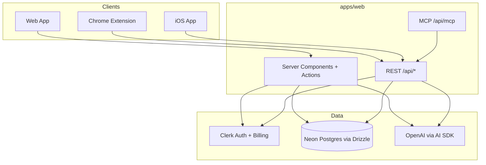
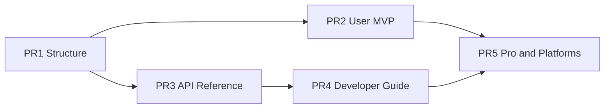

# Flashycardy Documentation Rewrite Plan

## Current State

[`apps/docs`](apps/docs) is a **Nextra 4** site (`content/` + `_meta.ts`, theme in [`app/layout.tsx`](apps/docs/app/layout.tsx) — **not** `theme.config.tsx`). It has **11 MDX pages**, almost entirely **developer/integration** content:

| Existing page | Audience | Migration target |
|---|---|---|
| `content/index.mdx` | Mixed stub | Replace with audience landing |
| `content/getting-started.mdx` | Dev stub | Split → `users/getting-started.mdx` + `developers/local-development.mdx` |
| `content/architecture.mdx` | Dev stub | → `developers/architecture.mdx` (expand) |
| `content/reference/rest-api.mdx` | Dev (311 lines, complete) | Split → `api/endpoints/*` |
| `content/reference/mcp.mdx` | Dev | → `api/mcp/overview.mdx` |
| `content/reference/mcp-architecture.mdx` | Dev | → `developers/mcp-architecture.mdx` |
| `content/how-to/extension-development.mdx` | Dev | → `developers/platforms/chrome-extension.mdx` |
| `content/how-to/ios-development.mdx` | Dev | → `developers/platforms/ios.mdx` |
| `content/how-to/chrome-web-store.mdx` | Dev | → `developers/platforms/chrome-web-store.mdx` |
| `content/how-to/vercel-mcp-production.mdx` | Dev | → `developers/deployment/mcp-vercel.mdx` |

**Gap:** Zero end-user documentation despite the web app Help menu linking to `https://flashycardy-docs.vercel.app/` ([`app-user-button.tsx`](apps/web/src/components/app-user-button.tsx)).

**Verified product surface (from code):**



---

## Target Directory Tree

```
apps/docs/content/
├── index.mdx                          # Audience landing (no mixed content)
├── _meta.ts                           # Top-level nav: Users | Developers | API
│
├── users/
│   ├── _meta.ts
│   ├── introduction.mdx
│   ├── getting-started.mdx
│   ├── account-management.mdx
│   ├── billing.mdx
│   ├── faq.mdx
│   ├── release-notes.mdx
│   ├── platforms/
│   │   ├── _meta.ts
│   │   ├── web.mdx
│   │   ├── chrome-extension.mdx
│   │   └── ios.mdx
│   ├── features/
│   │   ├── _meta.ts
│   │   ├── decks.mdx
│   │   ├── cards.mdx
│   │   ├── study-sessions.mdx
│   │   ├── analytics.mdx
│   │   ├── ai-flashcard-generation.mdx
│   │   ├── document-deck-import.mdx
│   │   ├── generate-from-page.mdx          # Extension-only (Pro)
│   │   ├── language-settings.mdx
│   │   └── onboarding-tour.mdx
│   ├── workflows/
│   │   ├── _meta.ts
│   │   ├── create-your-first-deck.mdx
│   │   ├── study-a-deck.mdx
│   │   ├── upgrade-to-pro.mdx
│   │   ├── import-a-document-deck.mdx
│   │   └── save-selection-from-browser.mdx # Extension context menu
│   └── troubleshooting/
│       ├── _meta.ts
│       ├── sign-in-issues.mdx
│       ├── deck-limit-reached.mdx
│       ├── ai-generation-failed.mdx
│       └── sync-across-devices.mdx
│
├── developers/
│   ├── _meta.ts
│   ├── introduction.mdx
│   ├── architecture.mdx
│   ├── monorepo-structure.mdx
│   ├── local-development.mdx
│   ├── environment-variables.mdx
│   ├── testing.mdx
│   ├── deployment.mdx
│   ├── ci-cd.mdx
│   ├── coding-standards.mdx
│   ├── contributing.mdx
│   ├── troubleshooting.mdx
│   ├── mcp-architecture.mdx               # From existing mcp-architecture.mdx
│   ├── data-model.mdx                     # decks, cards, study_sessions (conceptual)
│   ├── platforms/
│   │   ├── _meta.ts
│   │   ├── web.mdx
│   │   ├── chrome-extension.mdx
│   │   ├── ios.mdx
│   │   └── chrome-web-store.mdx
│   └── deployment/
│       ├── _meta.ts
│       ├── web-vercel.mdx
│       ├── docs-vercel.mdx
│       └── mcp-vercel.mdx
│
└── api/
    ├── _meta.ts
    ├── overview.mdx
    ├── authentication.mdx
    ├── rate-limits.mdx                    # TODO stub (see gaps)
    ├── errors.mdx
    ├── pagination-and-cors.mdx
    ├── mcp/
    │   ├── _meta.ts
    │   ├── overview.mdx                     # From existing mcp.mdx
    │   └── tools.mdx                        # 20 tools, 1:1 REST parity
    ├── endpoints/
    │   ├── _meta.ts
    │   ├── decks/
    │   │   ├── _meta.ts
    │   │   ├── list-decks.mdx               # GET /api/decks
    │   │   ├── create-deck.mdx              # POST /api/decks
    │   │   ├── deck-count.mdx               # GET /api/decks/count
    │   │   ├── get-deck.mdx                 # GET /api/decks/[deckUuid]
    │   │   ├── update-deck.mdx              # PUT/PATCH
    │   │   ├── delete-deck.mdx              # DELETE
    │   │   ├── generate-cards.mdx           # POST .../generate-cards
    │   │   ├── from-document.mdx            # POST /api/decks/from-document
    │   │   └── from-page.mdx                # POST /api/decks/from-page
    │   ├── cards/
    │   │   ├── _meta.ts
    │   │   ├── list-cards.mdx
    │   │   ├── create-card.mdx
    │   │   ├── get-card.mdx
    │   │   ├── update-card.mdx
    │   │   └── delete-card.mdx
    │   ├── ratings/
    │   │   └── list-ratings.mdx
    │   └── study-sessions/
    │       ├── _meta.ts
    │       ├── list-sessions.mdx
    │       ├── create-session.mdx
    │       └── session-counts.mdx
    └── examples/
        ├── _meta.ts
        ├── curl.mdx
        ├── typescript-api-client.mdx        # @flashycardy/api-client
        └── swift-ios-client.mdx
```

**Delete after migration:** `content/getting-started.mdx`, `content/architecture.mdx`, `content/reference/`, `content/how-to/`.

---

## Landing Page & Navigation

### Root landing ([`content/index.mdx`](apps/docs/content/index.mdx))

Two cards, zero overlap:

- **Using Flashycardy** → `/users/introduction` — decks, study, billing, platforms
- **Building & integrating** → `/developers/introduction` — monorepo, local dev, contributing
- Small footer link: **API Reference** → `/api/overview`

No monorepo paths, no REST paths, no Clerk SDK mentions on this page.

### Top-level `_meta.ts`

```typescript
const meta = {
  index: "Home",
  users: { title: "Product Guide", type: "page" },
  developers: { title: "Developer Guide", type: "page" },
  api: { title: "API Reference", type: "page" },
};
export default meta;
```

Each section gets its own `_meta.ts` with nested folders (`features/`, `workflows/`, `endpoints/decks/`, etc.).

### Navbar enhancement ([`app/layout.tsx`](apps/docs/app/layout.tsx))

Add explicit audience links so users never land in the wrong tree:

```tsx
const navbar = (
  <Navbar logo={<b>Flashycardy</b>}>
    {/* Nextra 4 Navbar children: Product Guide | Developer Guide | API */}
  </Navbar>
);
```

Update `metadata.description` to mention both audiences. Keep Pagefind search (build script unchanged).

### Sidebar organization

| Section | Sidebar order | Rule |
|---|---|---|
| **users/** | Introduction → Getting Started → Platforms → Features → Workflows → Account → Billing → Troubleshooting → FAQ → Release Notes | No code blocks except UI labels; link to `/pricing` not Clerk SDK |
| **developers/** | Introduction → Architecture → Monorepo → Local Dev → Env Vars → Testing → CI/CD → Deployment → Platforms → Data Model → MCP Architecture → Coding Standards → Contributing → Troubleshooting | Mermaid allowed; cite repo paths |
| **api/** | Overview → Authentication → Errors → Pagination → Endpoints (grouped by resource) → MCP → Examples | One endpoint per page; uniform template |

**Cross-linking rule:** User pages may link to `/users/*` only. Developer pages may link to `/developers/*` and `/api/*`. API pages link to `/developers/*` for setup context, never to `/users/*`.

---

## Page Templates

### User feature page (e.g. `users/features/ai-flashcard-generation.mdx`)

1. **What it is** — plain language
2. **When to use it** — vs manual card entry
3. **Requirements** — Pro plan (`ai_flashcard_generation`), deck must have description
4. **Steps** — numbered, platform tabs (Web / iOS / Extension where applicable)
5. **Expected outcome** — 20 new cards appended
6. **Troubleshooting** — link to `/users/troubleshooting/ai-generation-failed`
7. `<!-- screenshot: generate-with-ai-button -->` placeholders

### API endpoint page (e.g. `api/endpoints/decks/create-deck.mdx`)

Uniform sections: Route, Method, Purpose, Auth, Billing gates, Request body (Zod-aligned), Response, Status codes, Errors, Example (curl + TS client).

Source of truth: [`apps/web/src/app/api/`](apps/web/src/app/api/) route handlers + existing [`rest-api.mdx`](apps/docs/content/reference/rest-api.mdx).

### Developer architecture page

Include Mermaid diagrams for:
- Monorepo package graph (`apps/web`, `apps/docs`, `apps/extension`, `apps/ios`, `packages/*`)
- Request flow (Server Action vs REST vs MCP)
- Auth flow (Clerk session cookie vs Bearer JWT)

---

## Content to Write (Verified Features Only)

### User docs — feature inventory

| Page | Verified in | Pro gate |
|---|---|---|
| `decks.mdx` | Dashboard, CRUD dialogs, 3-deck limit | Free: 3 decks |
| `cards.mdx` | Deck detail CRUD | None |
| `study-sessions.mdx` | `StudySession` component, flip/mark/score | None |
| `analytics.mdx` | `/analytics` session history table | None |
| `ai-flashcard-generation.mdx` | `generate-cards-button.tsx`, 20 cards | `ai_flashcard_generation` |
| `document-deck-import.mdx` | Create deck dialog Document tab, PDF/DOCX/PPTX ≤10MB | `document_deck_generation` |
| `generate-from-page.mdx` | Extension only — `generate-from-page-button.tsx`, context menu | `document_deck_generation` |
| `language-settings.mdx` | Settings via UserButton, en/es | None |
| `onboarding-tour.mdx` | `dashboard-tour.tsx`, localStorage | None |
| `billing.mdx` | `/pricing`, `<PricingTable />`, feature slugs | — |
| `account-management.mdx` | Clerk UserButton: manage account, sign out, settings | — |

**Platform overviews** document where each client differs (extension: side panel + page scrape; iOS: native tabs; web: document upload tab).

### Developer docs — key topics

| Page | Source files |
|---|---|
| `monorepo-structure.mdx` | `pnpm-workspace.yaml`, `turbo.json`, root `package.json` |
| `local-development.mdx` | `pnpm dev`, `pnpm dev:docs`, `pnpm dev:extension`, `pnpm dev:ios` |
| `environment-variables.mdx` | Web: `DATABASE_URL`, `CLERK_*`, `OPENAI_API_KEY`, `REDIS_URL`; Extension: `VITE_*`; iOS: `Secrets.xcconfig` |
| `testing.mdx` | Vitest (web/packages), Playwright E2E, extension smoke, iOS xcodebuild |
| `ci-cd.mdx` | [`.github/workflows/ci.yml`](.github/workflows/ci.yml) |
| `deployment.mdx` | Vercel (web/docs), extension zip artifact, iOS App Store (checklist only) |
| `coding-standards.mdx` | `.cursor/rules/*` summary (query helpers, Server Actions, shadcn, TSDoc) |
| `data-model.mdx` | [`src/db/schema/`](apps/web/src/db/schema/) — decks, cards, study_sessions, study_session_cards |

### API docs — 14 REST paths → ~20 endpoint pages

Split monolithic `rest-api.mdx` into per-endpoint files. Shared conventions live in `api/overview.mdx`, `api/pagination-and-cors.mdx`, `api/authentication.mdx`, `api/errors.mdx`.

MCP: 20 tools documented in `api/mcp/tools.mdx` (mirror [`register-tools.ts`](apps/web/src/lib/mcp/register-tools.ts)).

---

## TODO Sections (Unverified / Missing in Code)

Mark these pages with a visible **TODO** callout — do not invent behavior:

| Topic | Page | Reason |
|---|---|---|
| Rate limits | `api/rate-limits.mdx` | No application-level rate limiting in route handlers; only WAF guidance in deploy doc |
| Guest language (web) | `users/features/language-settings.mdx` | Cookie mechanism exists in `i18n/request.ts` but **no web UI** to set it |
| OpenAPI spec | `api/overview.mdx` | No `openapi.yaml` in repo |
| Data export / GDPR | `users/account-management.mdx` | Not implemented |
| Admin console | — | No admin routes found |
| Server Actions | `developers/architecture.mdx` | Document as web-only RPC; explicitly **not** part of public API |
| iOS App Store release | `developers/platforms/ios.mdx` | Dev setup verified; store submission not in repo |

---

## Missing Documentation Inventory

### Critical (blocks user self-service)

1. **All user documentation** — Help menu points here today
2. **`users/billing.mdx`** — plan comparison, upgrade path, feature gates
3. **`users/workflows/create-your-first-deck.mdx`** — primary onboarding path
4. **`users/troubleshooting/deck-limit-reached.mdx`** — most common free-plan friction

### High (blocks integrators)

5. **Per-endpoint API pages** — monolithic doc hard to navigate
6. **`api/examples/typescript-api-client.mdx`** — [`packages/api-client`](packages/api-client)
7. **`developers/environment-variables.mdx`** — no central env reference exists
8. **`developers/testing.mdx`** — scattered across package scripts

### Medium (quality / maintenance)

9. **`developers/architecture.mdx`** — expand stub with diagrams
10. **`users/platforms/chrome-extension.mdx`** — extension-only flows undocumented for users
11. **`api/mcp/tools.mdx`** — tool reference separate from architecture
12. **`users/release-notes.mdx`** — start with "Initial public docs" entry

### Technical debt (assigned to PRs)

13. Update cursor rules — **PR 1** ([`.cursor/rules/diataxis-apps-docs.mdc`](.cursor/rules/diataxis-apps-docs.mdc), MCP/REST rules → `users/`, `developers/`, `api/` paths)
14. Help menu deep link to `/users/introduction` — **PR 2** ([`app-user-button.tsx`](apps/web/src/components/app-user-button.tsx))
15. Per-endpoint API pages — **PR 3** (`api/endpoints/*`)
16. Release notes seed — **PR 5** (`users/release-notes.mdx`)

---

## Pull Request Plan

Five sequential PRs. Each PR must pass `pnpm build:docs && pnpm lint:docs` before merge. Stack branches on the previous PR's branch until merged to `main`.



| PR | Branch | Depends on | Est. files |
|---|---|---|---|
| 1 | `docs/audience-split` | — | ~25 |
| 2 | `docs/user-guide-mvp` | PR 1 merged | ~15 |
| 3 | `docs/api-reference` | PR 1 merged | ~30 |
| 4 | `docs/developer-guide` | PR 3 merged | ~15 |
| 5 | `docs/pro-and-platforms` | PR 2 + PR 4 merged | ~15 |

PRs 2 and 3 can be opened in parallel after PR 1 lands. PR 4 needs the API path split from PR 3. PR 5 is last.

---

### PR 1 — Audience split & migration

**Branch:** `docs/audience-split`  
**Title:** `docs: split docs site into user, developer, and API sections`

**Scope**
- Create `users/`, `developers/`, `api/` folder tree with all `_meta.ts` files
- Replace `content/index.mdx` with audience landing (two cards + API footer link)
- Update [`app/layout.tsx`](apps/docs/app/layout.tsx) navbar (Product Guide | Developer Guide | API)
- Migrate existing content to new paths (move + fix internal links):
  - `reference/rest-api.mdx` → keep intact temporarily at `api/rest-api.mdx` (PR 3 splits it)
  - `reference/mcp.mdx` → `api/mcp/overview.mdx`
  - `reference/mcp-architecture.mdx` → `developers/mcp-architecture.mdx`
  - `how-to/*` → `developers/platforms/*` and `developers/deployment/mcp-vercel.mdx`
  - `getting-started.mdx` → stub `developers/local-development.mdx`
  - `architecture.mdx` → stub `developers/architecture.mdx`
- Add stub `_meta.ts` entries for pages created in later PRs (hidden or "Coming soon" one-liners optional)
- Delete `content/reference/`, `content/how-to/`, old top-level stubs
- Update [`.cursor/rules/diataxis-apps-docs.mdc`](.cursor/rules/diataxis-apps-docs.mdc) and MCP/REST rules to reference `users/`, `developers/`, `api/` paths

**Out of scope:** New user content, endpoint split, expanded developer pages

**Verify:** `pnpm build:docs && pnpm lint:docs`; sidebar shows three top-level sections; no broken links from migrated pages

---

### PR 2 — User guide MVP

**Branch:** `docs/user-guide-mvp`  
**Title:** `docs: add product guide for decks, study, billing, and account`

**Scope**
- Write full content for:
  - `users/introduction.mdx`, `getting-started.mdx`
  - `users/features/decks.mdx`, `cards.mdx`, `study-sessions.mdx`
  - `users/workflows/create-your-first-deck.mdx`, `study-a-deck.mdx`
  - `users/billing.mdx`, `account-management.mdx`
  - `users/troubleshooting/deck-limit-reached.mdx`, `sign-in-issues.mdx`
  - `users/faq.mdx`
- Update Help menu in [`app-user-button.tsx`](apps/web/src/components/app-user-button.tsx) to link to `/users/introduction`

**Out of scope:** Pro features, platform guides, analytics, release notes

**Verify:** `pnpm build:docs`; no developer/API content on user pages; Help link resolves

---

### PR 3 — API reference split

**Branch:** `docs/api-reference`  
**Title:** `docs: split REST API into per-endpoint reference pages`

**Scope**
- Write `api/overview.mdx`, `authentication.mdx`, `errors.mdx`, `pagination-and-cors.mdx`, `rate-limits.mdx` (TODO stub)
- Split migrated `rest-api.mdx` into `api/endpoints/decks/*`, `cards/*`, `ratings/*`, `study-sessions/*` (~20 pages)
- Write `api/examples/curl.mdx`, `typescript-api-client.mdx`
- Remove temporary monolithic `api/rest-api.mdx` if used as intermediate

**Out of scope:** MCP tools page (PR 5), Swift example (PR 5)

**Verify:** Every route in `apps/web/src/app/api/` has a matching endpoint page; uniform page template

---

### PR 4 — Developer guide expansion

**Branch:** `docs/developer-guide`  
**Title:** `docs: expand developer guide with architecture, env, testing, and deployment`

**Scope**
- Expand stubs into full pages:
  - `developers/introduction.mdx`, `architecture.mdx` (Mermaid diagrams), `monorepo-structure.mdx`
  - `developers/local-development.mdx`, `environment-variables.mdx`, `testing.mdx`
  - `developers/ci-cd.mdx`, `deployment.mdx`, `coding-standards.mdx`, `contributing.mdx`, `troubleshooting.mdx`
  - `developers/data-model.mdx`
  - `developers/platforms/web.mdx`, `chrome-extension.mdx`, `ios.mdx`, `chrome-web-store.mdx`
  - `developers/deployment/web-vercel.mdx`, `docs-vercel.mdx`

**Out of scope:** User-facing platform guides (PR 5)

**Verify:** Cross-links to `api/*` work; no user onboarding content

---

### PR 5 — Pro features, platforms, and MCP tools

**Branch:** `docs/pro-and-platforms`  
**Title:** `docs: add Pro feature docs, platform guides, and MCP tool reference`

**Scope**
- User docs:
  - `users/features/ai-flashcard-generation.mdx`, `document-deck-import.mdx`, `generate-from-page.mdx`, `analytics.mdx`, `language-settings.mdx`, `onboarding-tour.mdx`
  - `users/platforms/web.mdx`, `chrome-extension.mdx`, `ios.mdx`
  - `users/workflows/upgrade-to-pro.mdx`, `import-a-document-deck.mdx`, `save-selection-from-browser.mdx`
  - `users/troubleshooting/ai-generation-failed.mdx`, `sync-across-devices.mdx`
  - `users/release-notes.mdx` (seed entry)
- API docs:
  - `api/mcp/tools.mdx`, `api/examples/swift-ios-client.mdx`

**Out of scope:** OpenAPI spec, rate-limit implementation, iOS App Store submission (keep TODO callouts)

**Verify:** Pro billing gates documented consistently; extension-only features marked as such

---

### PR checklist (every PR)

- [ ] `pnpm build:docs` passes (includes Pagefind)
- [ ] `pnpm lint:docs` passes
- [ ] Internal links within changed section resolve
- [ ] Audience separation respected (no mixed user/dev content)
- [ ] `_meta.ts` updated for every new page
- [ ] No placeholder "coming soon" language on shipped features

---

## Documentation Gaps Summary

| Gap | Audience | Severity |
|---|---|---|
| Zero user-facing docs | Users | Critical |
| Help menu → generic docs root | Users | Critical |
| No rate limit policy documented | API | High (TODO until implemented) |
| No OpenAPI / machine-readable spec | API | Medium |
| No guest locale UI on web | Users | Low (document limitation) |
| Server Actions undocumented as web-internal | Developers | Medium |
| Release notes never maintained | Users | Medium |
| iOS App Store submission guide | Developers | Medium (TODO) |

---

## Implementation Notes

- **Nextra 4:** Theme config stays in [`app/layout.tsx`](apps/docs/app/layout.tsx); no `theme.config.tsx` needed.
- **Reuse:** ~70% of API content already exists in [`rest-api.mdx`](apps/docs/content/reference/rest-api.mdx) and MCP docs — refactor, don't rewrite from scratch.
- **Screenshot placeholders:** Use HTML comments `<!-- screenshot: ... -->` in user docs; no assets in Phase 1.
- **i18n:** User docs written in English; note that app UI supports en/es — do not duplicate message JSON in docs.
- **Billing language:** User docs say "Free" and "Pro" with feature names users see in upsell UI; developer/API docs use Clerk feature slugs (`unlimited_decks`, etc.).
