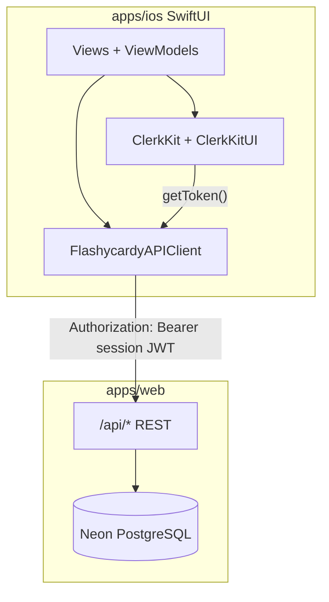

# iOS SwiftUI App — Web Feature Parity Plan

## North star

Ship a native **SwiftUI** app (`apps/ios`) that matches [`apps/web`](apps/web) user-facing features: deck/card CRUD, study sessions, analytics, AI generation, document deck creation, settings (language), and sign-in/sign-out. Data flows through the **existing REST API** in [`apps/web/src/app/api/`](apps/web/src/app/api/) with **Clerk Bearer tokens**—the same pattern as [`apps/extension`](apps/extension) + [`packages/api-client`](packages/api-client).

**v1 billing:** Open web [`/pricing`](apps/web/src/app/pricing/page.tsx) in Safari (like the extension). Apple IAP is a **follow-up project**, not v1.

**Out of scope (browser-only, not web parity):**
- Generate deck from page content (`POST /api/decks/from-page`)
- Context-menu “save selection as card”
- Dashboard Joyride onboarding tour
- MCP / AI agent endpoints

---

## Architecture



| Layer | Technology | Reference |
|-------|------------|-----------|
| UI | SwiftUI (iOS 17+) | Native reimplementation of web screens |
| Auth | [Clerk iOS SDK](https://clerk.com/docs/ios/getting-started/quickstart) (`ClerkKit`, `ClerkKitUI`) | [`apps/extension/src/screens/auth-gate.tsx`](apps/extension/src/screens/auth-gate.tsx) |
| API | `URLSession` + async/await Swift client | [`packages/api-client/src/`](packages/api-client/src/) |
| i18n | String Catalog (`.xcstrings`) | [`packages/i18n/messages/en.json`](packages/i18n/messages/en.json), [`es.json`](packages/i18n/messages/es.json) |
| Pro gates | API 403 + upgrade prompt → Safari `/pricing` | Extension `<Protect>` pattern in [`apps/extension/src/components/generate-cards-button.tsx`](apps/extension/src/components/generate-cards-button.tsx) |

---

## Feature parity matrix

| Web route / feature | iOS screen | API / auth |
|---------------------|------------|------------|
| `/` sign-in / sign-up | `AuthGateView` | `AuthView` (ClerkKitUI) |
| Sign out | `UserButton` menu | `clerk.auth.signOut()` |
| `/dashboard` | `DashboardView` | `GET/POST/PATCH/DELETE /api/decks`, `GET /api/decks/count`, `GET /api/study-sessions/counts` |
| Create deck (manual) | Sheet / form | `POST /api/decks` |
| Create deck (document, Pro) | Document picker → base64 | `POST /api/decks/from-document` |
| `/decks/:uuid` | `DeckDetailView` | `GET /api/decks/:uuid`, card CRUD routes, `GET /api/decks/:uuid/ratings` |
| AI generate 20 cards (Pro) | Button + loading state | `POST /api/decks/:uuid/generate-cards` |
| `/decks/:uuid/study` | `StudyView` | In-memory session; `POST /api/study-sessions` on complete |
| `/analytics` | `AnalyticsView` | `GET /api/study-sessions` |
| Settings (language) | Custom `UserProfileView` row | Clerk `user.update(unsafeMetadata:)` — same as [`apps/extension/src/screens/settings-screen.tsx`](apps/extension/src/screens/settings-screen.tsx) |
| `/pricing` | Safari link | `SFSafariViewController` → `{API_BASE_URL}/pricing` |
| Deck limit banner (free) | Banner on dashboard | Client: `GET /api/decks/count`; server enforces 403 on create |

Study UX parity with [`@flashycardy/features` StudySession](packages/features): flip card, prev/next, shuffle, reset, thumbs up/down, completion summary.

---

## Project layout

Create **`apps/ios/`** in the monorepo (Xcode project, not a pnpm package):

```
apps/ios/
├── Flashycardy.xcodeproj
├── Flashycardy/
│   ├── App/
│   │   ├── FlashycardyApp.swift      # Clerk.configure + .environment(Clerk.shared)
│   │   └── RootView.swift            # Auth gate → TabView / NavigationStack
│   ├── Services/
│   │   ├── APIClient.swift           # Bearer fetch, envelope parsing, ApiError
│   │   ├── DecksService.swift
│   │   ├── CardsService.swift
│   │   └── StudySessionsService.swift
│   ├── Models/                       # Deck, Card, StudySession (mirror api-client types)
│   ├── Features/
│   │   ├── Auth/AuthGateView.swift
│   │   ├── Dashboard/
│   │   ├── DeckDetail/
│   │   ├── Study/
│   │   ├── Analytics/
│   │   └── Settings/PreferencesView.swift
│   ├── Components/                   # DeckCard, FlashcardView, SortPicker, etc.
│   └── Resources/
│       ├── Localizable.xcstrings     # en + es (ported from packages/i18n)
│       └── Assets.xcassets           # Dark-mode-first palette matching web
├── FlashycardyTests/
│   └── APIClientTests.swift
├── .env.example                      # CLERK_PUBLISHABLE_KEY, API_BASE_URL
└── README.md
```

Add root script in [`package.json`](package.json): `"dev:ios": "open apps/ios/Flashycardy.xcodeproj"` (documentation only; Xcode builds outside Turbo).

---

## Prerequisites (Clerk Dashboard — before coding auth)

Use the **same Clerk instance** as web (`pk_test_...` / `pk_live_...` from root [`.env`](.env)).

1. **Enable Native API** — [Clerk Dashboard → Native applications](https://dashboard.clerk.com/~/native-applications) (required for iOS SDK; same step as Chrome extension).
2. **Associated Domains** — In Xcode Signing & Capabilities, add:
   - `webcredentials:{YOUR_FRONTEND_API_URL}` (from Clerk quickstart)
3. **Bundle ID** — Register a stable bundle ID (e.g. `com.flashycardy.app`) in Apple Developer + Clerk if required for OAuth redirect allowlists.
4. **Auth methods** — Ensure email/password and OAuth providers enabled in [User & authentication](https://dashboard.clerk.com/~/user-authentication).
5. **Billing feature slugs** — Confirm `free_user`, `pro`, `3_deck_limit`, `unlimited_decks`, `ai_flashcard_generation`, `document_deck_generation` exist (server-side gates already in REST handlers).

---

## Swift API client (mirror `@flashycardy/api-client`)

Implement a typed client in Swift that matches [`packages/api-client/src/client.ts`](packages/api-client/src/client.ts):

```swift
// Token injection — mirrors extension ApiProvider
let token = try await Clerk.shared.auth.getToken()
request.setValue("Bearer \(token)", forHTTPHeaderField: "Authorization")
```

**Endpoints to wrap** (full list in [`apps/docs/content/reference/rest-api.mdx`](apps/docs/content/reference/rest-api.mdx)):

- Decks: list, count, get, create, replace, patch, delete, generateCards, createFromDocument
- Cards: list (via deck get), create, replace, patch, delete
- Ratings: `GET /api/decks/:uuid/ratings`
- Study sessions: list, create, counts

**Response handling:** Parse `{ data }` / `{ data, meta, links }` / `{ error }`; throw typed `ApiError(statusCode:message:)` for 401/403/404.

**No backend changes required for v1** — Bearer auth is already implemented in [`apps/web/src/lib/api/with-auth.ts`](apps/web/src/lib/api/with-auth.ts).

---

## Auth flow

```swift
// FlashycardyApp.swift
@main
struct FlashycardyApp: App {
    init() {
        Clerk.configure(publishableKey: Config.clerkPublishableKey)
    }
    var body: some Scene {
        WindowGroup {
            RootView()
                .environment(Clerk.shared)
                .task { try? await Clerk.shared.load() }
        }
    }
}
```

**RootView logic** (mirrors extension auth gate):
- `clerk.user == nil` → `AuthView()` with Sign In / Sign Up
- `clerk.user != nil` → main app (`TabView`: Dashboard, Analytics; profile via `UserButton`)
- **Sign out:** Clerk `UserButton` default row or explicit `clerk.auth.signOut()`

**Token refresh:** `Clerk.shared.auth.getToken()` handles caching; call before each API request (or inject via `APIClient` actor).

---

## Screen implementation notes

### Dashboard
- Paginated deck grid (pageSize 9 to match web)
- Sort: updated / A–Z / Z–A (locale-aware via `Locale.current`)
- Deck limit banner when count ≥ 3 and create returns 403
- Create deck sheet: name + description; Pro tab for document upload via `UIDocumentPickerViewController` → base64 → `createFromDocument`
- Edit/delete deck via swipe actions or context menu

### Deck detail
- Paginated cards, sort, per-card rating badges from ratings endpoint
- Add/edit/delete card sheets
- “Generate with AI” button (Pro): show upgrade sheet on 403 linking to `/pricing`
- NavigationLink to Study

### Study
- `@Observable` view model holding card order, current index, flipped state, shuffle flag, ratings map
- On complete: `POST /api/study-sessions` with `{ deckUuid, cardResults: [{ cardUuid, isCorrect }] }`
- Summary screen with score %

### Analytics
- List study sessions with deck name, totals, score badge colors matching web thresholds
- Tap row → navigate to deck detail

### Settings / Preferences
- Custom `UserProfileView` row (ClerkKitUI pattern from iOS SDK docs)
- Language picker (en/es) → `user.update(unsafeMetadata: ["language": locale])` → reload app strings
- Read initial locale from `user.unsafeMetadata.language` (same as web [`src/i18n/request.ts`](apps/web/src/i18n/request.ts))

### Pricing / Pro upgrade
- Never embed Stripe or custom paywall in v1
- On 403 with feature error, show alert with “Upgrade to Pro” → `SFSafariViewController(url: baseURL + "/pricing")`

---

## i18n strategy

1. Export message keys from [`packages/i18n/messages/en.json`](packages/i18n/messages/en.json) and `es.json` into `Localizable.xcstrings` (namespaces: Auth, Dashboard, DeckDetail, StudyClient, Analytics, Settings, Actions, Validation, Common).
2. Use `String(localized:)` / generated `LocalizedStringResource` in views.
3. On language save, set `@AppStorage` or environment locale override + reload from Clerk metadata.
4. **Maintenance rule:** When web i18n keys change, update iOS String Catalog in the same PR (document in [`apps/ios/README.md`](apps/ios/README.md)).

---

## Pro / billing client-side gating

Server REST handlers already call `has({ feature: ... })` and return **403**. iOS v1 strategy:

- **Do not** rely on a Clerk iOS `<Show>` equivalent for billing (limited compared to web/extension).
- **Do** attempt the action; on 403, map error message and show upgrade UI.
- Optionally cache plan hints from last successful API response metadata if added later; not required for v1.

**Follow-up (post-v1):** Apple IAP + Clerk entitlement sync — separate design doc; out of this plan.

---

## Testing & CI

| Type | Tool | Scope |
|------|------|-------|
| Unit | XCTest | API envelope parsing, pagination query builder, model decoding |
| UI | XCUITest | Auth gate → sign in (test account) → dashboard loads |
| Manual QA | Staging API | Full CRUD, study save, analytics, document upload, AI generate (Pro test user) |

**CI (GitHub Actions):** `xcodebuild test -scheme Flashycardy -destination 'platform=iOS Simulator,name=iPhone 16'` on macOS runner. Store Clerk test keys in repo secrets.

**Local dev:** Point `API_BASE_URL` to `http://localhost:3000` (simulator) or machine IP for device testing; run `pnpm dev:web` from monorepo root.

---

## Documentation updates

Per [`diataxis-apps-docs.mdc`](.cursor/rules/diataxis-apps-docs.mdc):

- **How-to:** `apps/docs/content/how-to/ios-development.mdx` — setup, env vars, Clerk dashboard steps, running against local API
- **Reference:** Note iOS as a Bearer-token REST consumer in `rest-api.mdx` intro (alongside extension)
- **Explanation:** Brief note in architecture doc that mobile clients use REST + Clerk Native, not Server Actions

---

## Delivery phases (recommended PRs)

### PR-1 — Scaffold + auth
- Xcode project, SPM deps (`clerk-ios` ClerkKit + ClerkKitUI)
- Clerk configure, Associated Domains, AuthGateView, sign-out
- Config via xcconfig / `.env` injection (publishable key, API base URL)
- README + `.env.example`

### PR-2 — API client + models
- Swift `APIClient`, `ApiError`, Codable models mirroring [`packages/api-client/src/types.ts`](packages/api-client/src/types.ts)
- DecksService, CardsService, StudySessionsService
- XCTest for JSON envelope + pagination

### PR-3 — Dashboard + deck CRUD
- DashboardView: list, sort, pagination, create/edit/delete deck
- Deck limit banner
- Navigation to deck detail

### PR-4 — Deck detail + cards
- Card list, CRUD dialogs, ratings display, sort/pagination
- Navigation to study

### PR-5 — Study + analytics
- StudyView with full session UX + save
- AnalyticsView with session history

### PR-6 — Pro features + settings + i18n
- Document upload deck creation
- AI generate cards button
- PreferencesView (language)
- String Catalog (en/es)
- Safari pricing link on upgrade prompts

### PR-7 — Polish + CI + docs
- Dark mode QA, loading/error states, pull-to-refresh
- XCUITest smoke test
- GitHub Actions iOS job
- `apps/docs` how-to page

---

## Key risks & mitigations

| Risk | Mitigation |
|------|------------|
| Apple App Store subscription rules | v1 uses external Safari pricing; plan IAP before App Store submission if Apple rejects external links |
| Large document base64 uploads | Enforce 10 MB limit client-side (matches REST API); show progress indicator |
| iOS cannot use `@flashycardy/features` React components | Reimplement study/card UI in SwiftUI; use extension screens as UX reference |
| i18n drift from web | Shared key naming convention; CI check script comparing key sets (optional PR-7) |
| Simulator localhost networking | Use `127.0.0.1` or host machine IP; document in README |

---

## Success criteria

- User can sign in, sign out, and session persists across app restarts
- All web CRUD flows work against production/staging REST API
- Study session saves and appears in Analytics
- Pro features work for Pro test users; free users see deck limit + upgrade prompt
- English and Spanish UI strings available
- App builds and tests pass on iOS 17+ simulator
