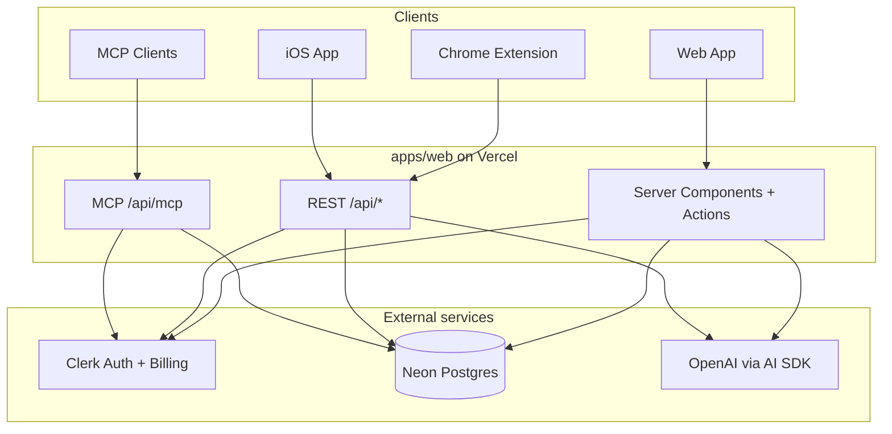
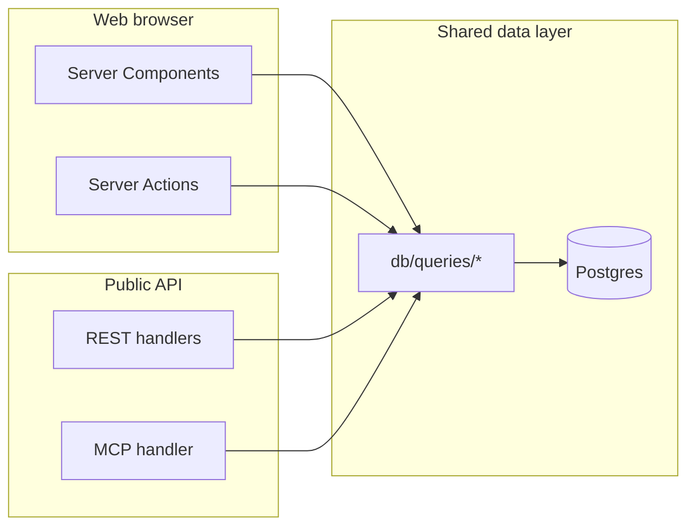
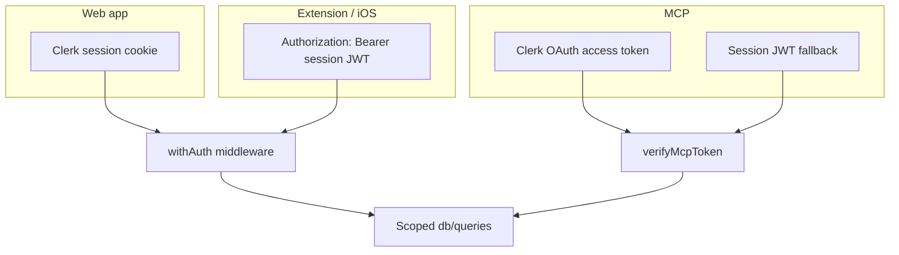

# Architecture

High-level view of how Flashycardy components connect. For file-level layout, see [Monorepo structure](/developers/monorepo-structure). For database tables, see [Data model](/developers/data-model).

## System context

## Request paths (web app)

| Path | Used by | Notes |
|------|---------|-------|
| Server Components → query helpers | Web UI | Read-only data in RSC |
| Server Actions → query helpers | Web UI | Mutations; **not** a public API |
| REST `/api/*` | Extension, iOS, integrators | Bearer or cookie auth |
| MCP `/api/mcp` | AI agents | OAuth preferred; tools mirror REST |

Server Actions are **web-only** RPC — never call them from mobile or extension clients. See [API authentication](/api/authentication).

## Auth flow

Every query filters by `clerkUserId` from `auth()` — never trust client-supplied user IDs.

## Shared packages

| Package | Role |
|---------|------|
| `@flashycardy/ui` | shadcn/ui components + Tailwind globals |
| `@flashycardy/features` | Props-driven deck/card/study UI |
| `@flashycardy/api-client` | Typed REST client |
| `@flashycardy/i18n` | Locales (`en`, `es`) and messages |

Web and extension import shared packages. iOS uses Swift services that mirror the API client.

## Docs site

`apps/docs` is an independent Nextra app. It does **not** import from `apps/web`, keeping docs builds fast and deploys separate from production.

## Related

- [Data model](/developers/data-model)
- [MCP architecture](/developers/mcp-architecture)
- [API overview](/api/overview)
