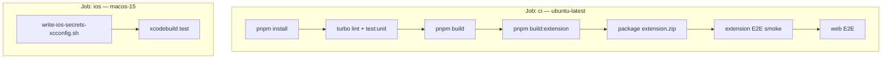

# CI/CD

Continuous integration runs on **GitHub Actions** (`.github/workflows/ci.yml`) for every push to `main` and all pull requests.

## Workflow overview



## Job: `ci` (Ubuntu)

**Node:** 22 · **pnpm:** 10

1. **Lint and unit test** — packages:
   - `@flashycardy/web`
   - `@flashycardy/extension`
   - `@flashycardy/api-client`
   - `@flashycardy/features`
   - `@flashycardy/ui`
   - `@flashycardy/i18n`

2. **Build web** — `pnpm build`

3. **Build extension** — `pnpm build:extension`

4. **Package** — `dist/extension.zip` uploaded as artifact

5. **Playwright** — extension smoke, then web E2E

### CI environment variables

Placeholder values allow builds without all secrets:

| Variable | Fallback when secret missing |
|----------|------------------------------|
| `VITE_CLERK_PUBLISHABLE_KEY` | `pk_test_ci_build_only` |
| `VITE_CLERK_FRONTEND_API` | `https://placeholder.clerk.accounts.dev` |
| `VITE_SYNC_HOST` / `VITE_API_BASE_URL` | `http://localhost:3000` |

## Job: `ios` (macOS 15)

1. Writes `Secrets.xcconfig` from `NEXT_PUBLIC_CLERK_PUBLISHABLE_KEY` and `VITE_CLERK_FRONTEND_API`
2. Runs `xcodebuild test` on **iPhone 17** simulator

## Concurrency

```yaml
concurrency:
  group: ci-${{ github.workflow }}-${{ github.ref }}
  cancel-in-progress: true
```

In-flight runs for the same branch are cancelled when a new commit pushes.

## Deployment

CI does **not** deploy to Vercel — deployment is Vercel Git integration per app. See [Deployment](/developers/deployment).

## Related

- [Testing](/developers/testing)
- [Environment variables](/developers/environment-variables)
