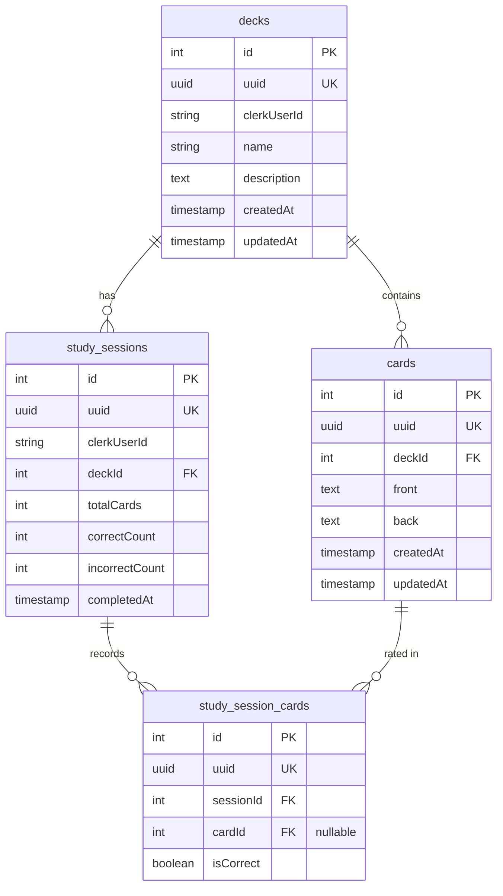

# Data model

Postgres schema managed by **Drizzle ORM**. Source of truth: `apps/web/src/db/schema/`. Migrations under `drizzle/dev/` and `drizzle/prod/`.

## Entity relationship

## Tables

### `decks`

User-owned flashcard collections.

| Column | Notes |
|--------|-------|
| `id` | Internal integer PK |
| `uuid` | Public identifier (UUID v7) — used in API paths |
| `clerkUserId` | Owner — all queries filter on this |
| `name` | Required, max 255 chars |
| `description` | Optional text |

### `cards`

Flashcards belonging to a deck. Cascade delete when deck is removed.

| Column | Notes |
|--------|-------|
| `deckId` | FK → `decks.id` |
| `front` / `back` | Required text |
| `uuid` | Public identifier for API |

### `study_sessions`

One row per completed study run.

| Column | Notes |
|--------|-------|
| `deckId` | FK → `decks.id` |
| `totalCards` | Cards in session |
| `correctCount` / `incorrectCount` | Aggregates |
| `completedAt` | Timestamp |

### `study_session_cards`

Per-card results within a session. `cardId` is **nullable** (`onDelete: set null`) so history survives card deletion.

## Public identifiers

API routes use **`uuid`** fields (`deckUuid`, `cardUuid`), not integer `id` values. Integer IDs are internal.

## Ratings API

`GET /api/decks/{deckUuid}/ratings` aggregates `study_session_cards` into per-card correct/incorrect counts — not a separate table.

## Related

- [Architecture](/developers/architecture)
- [API overview](/api/overview)
- [Local development](/developers/local-development) — migration commands
