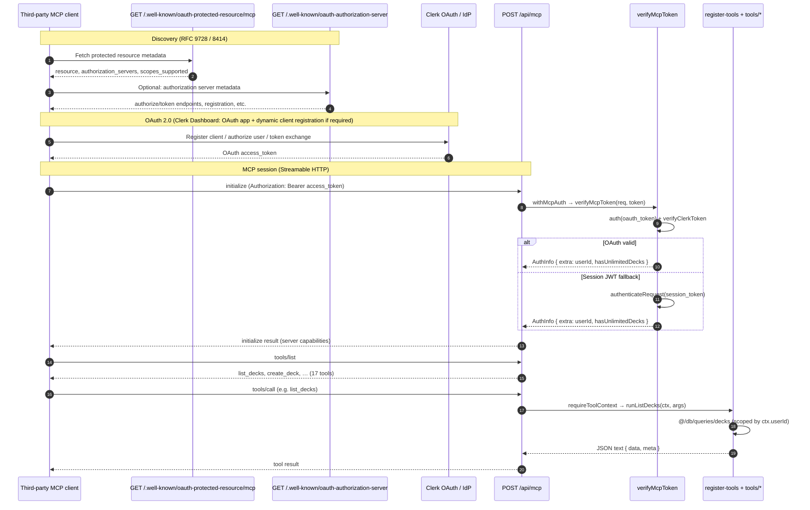
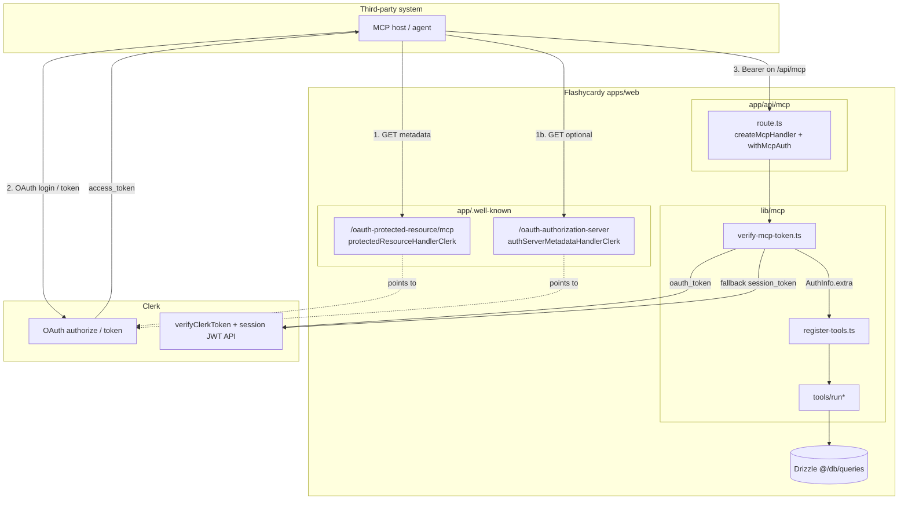
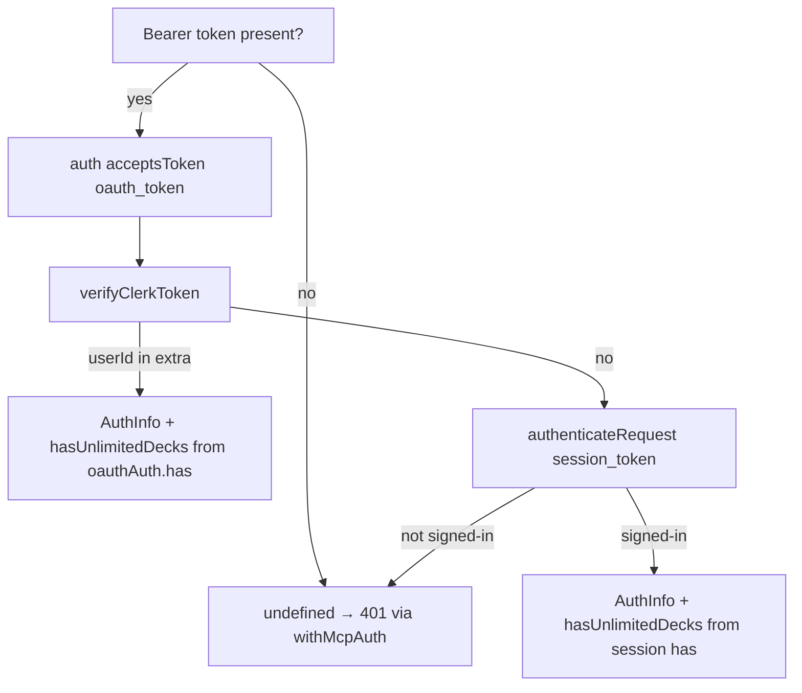

# MCP architecture & dependencies

How **`apps/web`** wires Clerk OAuth discovery, the Streamable HTTP MCP endpoint, and tool handlers. For client setup, see [Model Context Protocol (MCP)](/api/mcp/overview).

## File dependency tree

Imports **within** the three areas (`app/.well-known`, `app/api/mcp`, `lib/mcp`) plus their main **external** dependencies. Dashed lines are **logical** links (URL paths), not TypeScript imports.

```
apps/web/src/
│
├── app/.well-known/                          (OAuth metadata — no lib/mcp imports)
│   ├── oauth-authorization-server/
│   │   └── route.ts
│   │       ├── @clerk/mcp-tools/next → authServerMetadataHandlerClerk
│   │       └── @clerk/mcp-tools/next → metadataCorsOptionsRequestHandler (OPTIONS)
│   │
│   └── oauth-protected-resource/mcp/
│       └── route.ts
│           ├── @clerk/mcp-tools/next → protectedResourceHandlerClerk
│           └── @clerk/mcp-tools/next → metadataCorsOptionsRequestHandler (OPTIONS)
│
├── app/api/mcp/
│   └── route.ts                              (HTTP entry — Streamable MCP)
│       ├── mcp-handler → createMcpHandler, withMcpAuth
│       ├── @/lib/mcp/register-tools.ts ───────────────┐
│       ├── @/lib/mcp/verify-mcp-token.ts ─────────────┤
│       │                                              │
│       │   resourceMetadataPath (config only)         │
│       │   ═══════════════════════════════════════    │
│       └── points to ──► /.well-known/oauth-protected-resource/mcp
│
└── lib/mcp/
    │
    ├── verify-mcp-token.ts ◄────────────────── used only by app/api/mcp/route.ts
    │   ├── @clerk/nextjs/server → auth({ acceptsToken: "oauth_token" })
    │   ├── @clerk/mcp-tools/next → verifyClerkToken
    │   ├── @clerk/backend → createClerkClient, authenticateRequest (session fallback)
    │   └── @modelcontextprotocol/sdk → AuthInfo type
    │
    ├── register-tools.ts ◄──────────────────── called from createMcpHandler callback
    │   ├── extra.ts → parseMcpAuthExtra
    │   ├── tool-result.ts → mcpToolError
    │   ├── @modelcontextprotocol/sdk → McpServer
    │   ├── zod
    │   └── tools/*.ts (17 runners + input schemas) ──┐
    │                                                  │
    ├── extra.ts                                       │
    │   ├── zod                                        │
    │   └── @modelcontextprotocol/sdk → AuthInfo       │
    │                                                  │
    ├── tool-context.ts          (type only, no imports)
    ├── tool-result.ts           (type + helpers, no lib/mcp imports)
    ├── pagination-args.ts       (zod; used by list-style tools)
    ├── constants.ts → FREE_DECK_LIMIT (used by create-deck)
    │
    └── tools/
        ├── create-deck.ts ──────► constants, tool-context, tool-result, @/db/queries/decks
        ├── list-decks.ts ───────► pagination-args, tool-context, tool-result, @/db/queries/decks
        ├── get-deck-count.ts ───► tool-context, tool-result, @/db/queries/decks
        ├── get-deck.ts ─────────► pagination-args, tool-context, tool-result, decks + cards queries
        ├── replace-deck.ts ─────► tool-context, tool-result, @/db/queries/decks
        ├── patch-deck.ts ───────► tool-context, tool-result, @/db/queries/decks
        ├── delete-deck.ts ──────► tool-context, tool-result, @/db/queries/decks
        ├── list-cards.ts ───────► pagination-args, tool-context, tool-result, @/db/queries/cards
        ├── create-card.ts ──────► tool-context, tool-result, @/db/queries/cards
        ├── get-card.ts ─────────► tool-context, tool-result, decks + cards queries
        ├── replace-card.ts ─────► tool-context, tool-result, @/db/queries/cards
        ├── patch-card.ts ───────► tool-context, tool-result, decks + cards queries
        ├── delete-card.ts ──────► tool-context, tool-result, @/db/queries/cards
        ├── list-ratings.ts ─────► pagination-args, tool-context, tool-result, decks + study-sessions queries
        ├── list-study-sessions.ts ► pagination-args, tool-context, tool-result, study-sessions queries
        ├── create-study-session.ts ► tool-context, tool-result, study-sessions queries
        ├── list-study-session-counts.ts ► pagination-args, tool-context, tool-result, study-sessions queries
        │
        └── *.test.ts ───────────► vitest; mocks @/db/queries/* + local run* under test
```

### Layer summary

| Layer | Path | Role |
|-------|------|------|
| Discovery | `app/.well-known/**` | RFC 9728 / 8414 metadata for MCP OAuth (Clerk handlers). |
| Transport | `app/api/mcp/route.ts` | `mcp-handler` + auth wrapper; exposes GET/POST/DELETE on `/api/mcp`. |
| Auth | `lib/mcp/verify-mcp-token.ts` | Bearer → `AuthInfo` (OAuth first, session JWT fallback). |
| Registry | `lib/mcp/register-tools.ts` | Registers 17 tools; maps `authInfo.extra` → `McpToolContext`. |
| Execution | `lib/mcp/tools/*` | Zod input + `run*` → Drizzle query helpers (`@/db/queries/*`). |

---

## Third-party connection flow (OAuth + MCP)

How an external MCP host (Cursor, Claude Desktop via `mcp-remote`, custom agent, etc.) discovers Clerk, obtains a token, lists tools, and calls them.



### Flow diagram (components)



### MCP methods the client typically uses

| Phase | MCP / HTTP | What happens |
|-------|------------|----------------|
| Discovery | `GET` well-known URLs | Client learns Clerk issuer, scopes (`profile`, `email`), and resource identifier for `/api/mcp`. |
| OAuth | Clerk-hosted | User consents; client receives **OAuth access token** (recommended). |
| Session | `POST /api/mcp` | `initialize` — `withMcpAuth` runs **`verifyMcpToken`** before handler body runs. |
| Tools | `tools/list` | **`registerFlashycardyMcpTools`** exposes 17 tool names + Zod-shaped inputs. |
| Invoke | `tools/call` | Handler reads **`parseMcpAuthExtra`**, calls **`run*`** with **`McpToolContext`**, returns REST-shaped JSON in text content. |

### Auth decision inside `verifyMcpToken`



---

## Related

- [Model Context Protocol (MCP)](/api/mcp/overview) — endpoints, tools table, client config
- [Deploy MCP on Vercel](/developers/deployment/mcp-vercel) — production checklist
- [HTTP API (REST)](/api/overview) — same data model; session/cookie auth vs MCP OAuth
